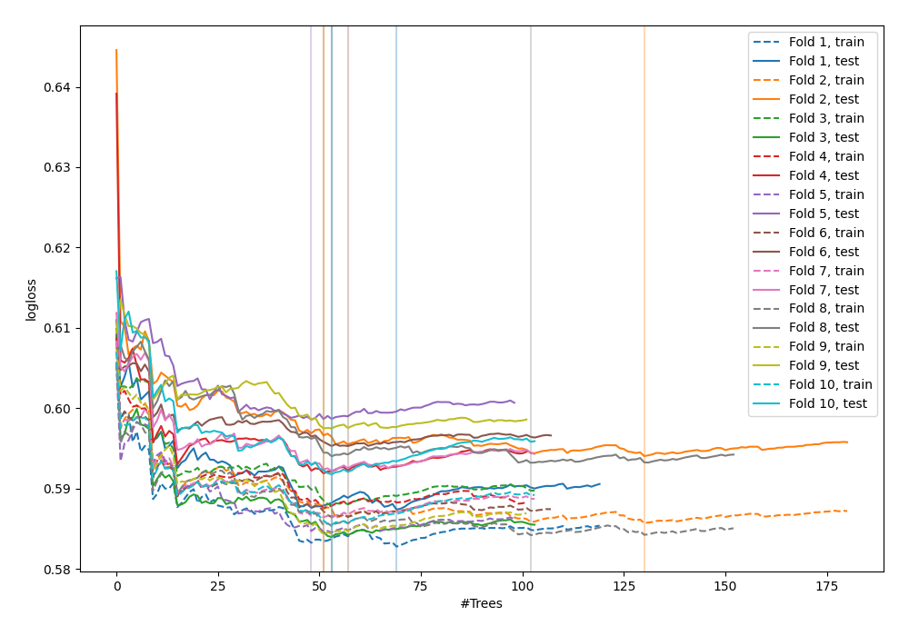

# Summary of 10_Default_ExtraTrees

[<< Go back](../README.md)

## Extra Trees Classifier (Extra Trees)
- **n_jobs**: -1
- **criterion**: gini
- **max_features**: 0.9
- **min_samples_split**: 30
- **max_depth**: 4
- **explain_level**: 0

## Validation
 - **validation_type**: kfold
 - **shuffle**: True
 - **stratify**: True
 - **k_folds**: 10

## Optimized metric
logloss

## Training time

14.6 seconds

## Metric details
|           |    score |   threshold |
|:----------|---------:|------------:|
| logloss   | 0.592587 | nan         |
| auc       | 0.674221 | nan         |
| f1        | 0.527528 |   0.283972  |
| accuracy  | 0.702851 |   0.369874  |
| precision | 0.552147 |   0.369874  |
| recall    | 1        |   0.0813651 |
| mcc       | 0.256773 |   0.279987  |

## Confusion matrix (at threshold=0.369874)
|                     |   Predicted as negative |   Predicted as positive |
|:--------------------|------------------------:|------------------------:|
| Labeled as negative |                    2351 |                      73 |
| Labeled as positive |                     959 |                      90 |

## Learning curves

[<< Go back](../README.md)
