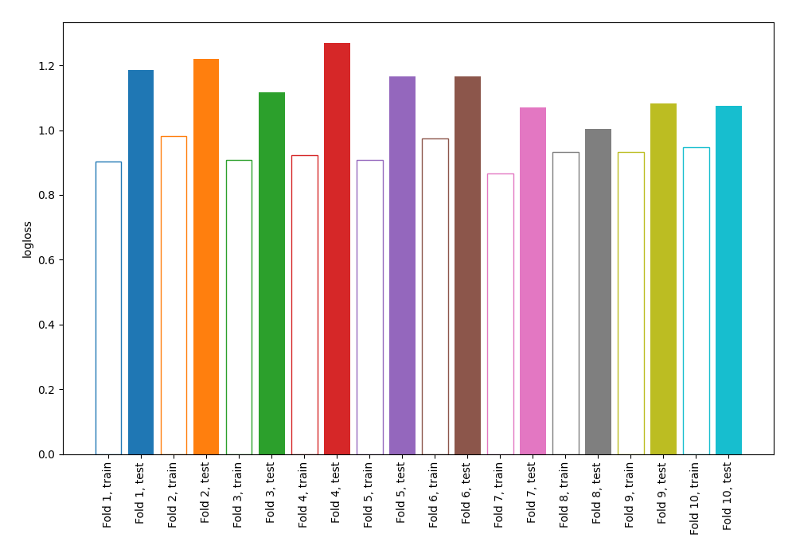

# Summary of 11_Default_NearestNeighbors

[<< Go back](../README.md)

## k-Nearest Neighbors (Nearest Neighbors)
- **n_jobs**: -1
- **n_neighbors**: 5
- **weights**: uniform
- **explain_level**: 0

## Validation
 - **validation_type**: kfold
 - **shuffle**: True
 - **stratify**: True
 - **k_folds**: 10

## Optimized metric
logloss

## Training time

3.1 seconds

## Metric details
|           |    score |   threshold |
|:----------|---------:|------------:|
| logloss   | 1.13536  |       nan   |
| auc       | 0.595123 |       nan   |
| f1        | 0.478673 |         0   |
| accuracy  | 0.693349 |         0.6 |
| precision | 0.451807 |         0.6 |
| recall    | 0.86654  |         0   |
| mcc       | 0.130973 |         0.2 |

## Confusion matrix (at threshold=0.6)
|                     |   Predicted as negative |   Predicted as positive |
|:--------------------|------------------------:|------------------------:|
| Labeled as negative |                    2333 |                      91 |
| Labeled as positive |                     974 |                      75 |

## Learning curves

[<< Go back](../README.md)
