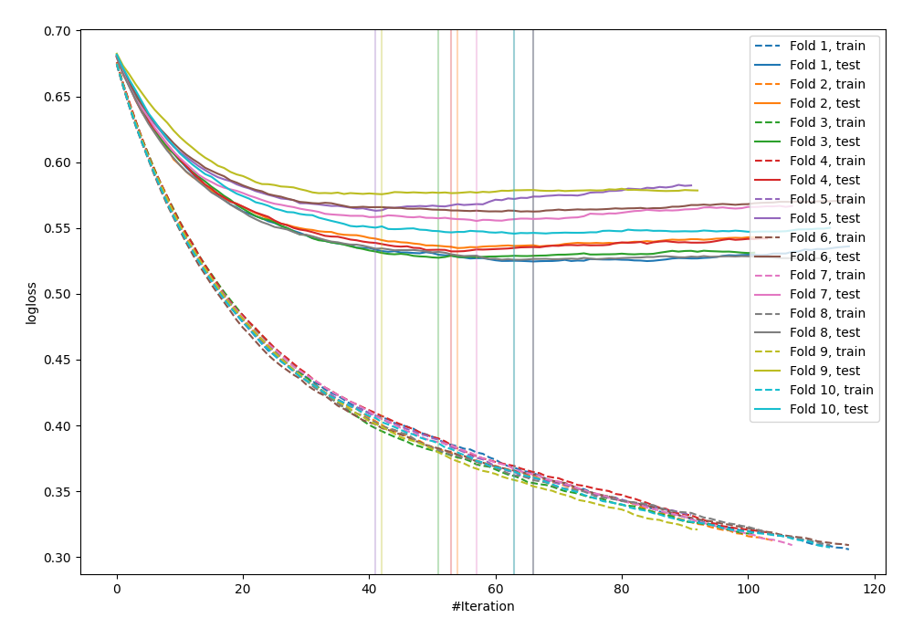

# Summary of 12_Xgboost

[<< Go back](../README.md)

## Extreme Gradient Boosting (Xgboost)
- **n_jobs**: -1
- **objective**: binary:logistic
- **eval_metric**: logloss
- **eta**: 0.05
- **max_depth**: 8
- **min_child_weight**: 5
- **subsample**: 1.0
- **colsample_bytree**: 1.0
- **explain_level**: 0

## Validation
 - **validation_type**: kfold
 - **shuffle**: True
 - **stratify**: True
 - **k_folds**: 10

## Optimized metric
logloss

## Training time

13.5 seconds

## Metric details
|           |    score |   threshold |
|:----------|---------:|------------:|
| logloss   | 0.544675 | nan         |
| auc       | 0.699723 | nan         |
| f1        | 0.544064 |   0.258357  |
| accuracy  | 0.704002 |   0.575161  |
| precision | 0.546667 |   0.575161  |
| recall    | 1        |   0.0178688 |
| mcc       | 0.298694 |   0.168671  |

## Confusion matrix (at threshold=0.575161)
|                     |   Predicted as negative |   Predicted as positive |
|:--------------------|------------------------:|------------------------:|
| Labeled as negative |                    2322 |                     102 |
| Labeled as positive |                     926 |                     123 |

## Learning curves

[<< Go back](../README.md)
