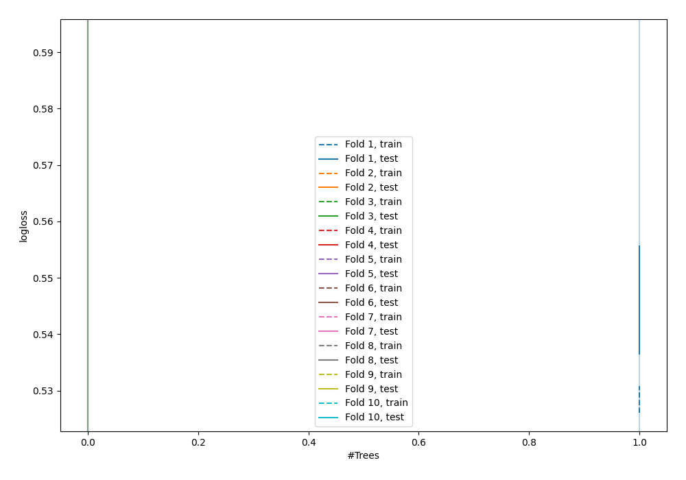

# Summary of 1_DecisionTree

[<< Go back](../README.md)

## Decision Tree
- **n_jobs**: -1
- **criterion**: gini
- **max_depth**: 3
- **explain_level**: 0

## Validation
 - **validation_type**: kfold
 - **shuffle**: True
 - **stratify**: True
 - **k_folds**: 10

## Optimized metric
logloss

## Training time

2.2 seconds

## Metric details
|           |    score |    threshold |
|:----------|---------:|-------------:|
| logloss   | 0.553303 | nan          |
| auc       | 0.68428  | nan          |
| f1        | 0.535052 |   0.205272   |
| accuracy  | 0.698244 |   0.681818   |
| precision | 0.666667 |   0.681818   |
| recall    | 1        |   0.00170455 |
| mcc       | 0.280624 |   0.205272   |

## Confusion matrix (at threshold=0.681818)
|                     |   Predicted as negative |   Predicted as positive |
|:--------------------|------------------------:|------------------------:|
| Labeled as negative |                    2423 |                       1 |
| Labeled as positive |                    1047 |                       2 |

## Learning curves

[<< Go back](../README.md)
