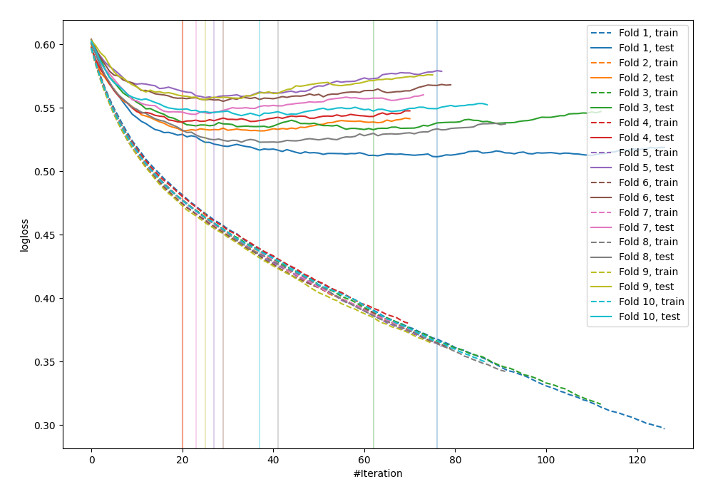

# Summary of 21_LightGBM

[<< Go back](../README.md)

## LightGBM
- **n_jobs**: -1
- **objective**: binary
- **metric**: binary_logloss
- **num_leaves**: 15
- **learning_rate**: 0.1
- **feature_fraction**: 0.8
- **bagging_fraction**: 0.8
- **min_data_in_leaf**: 10
- **explain_level**: 0

## Validation
 - **validation_type**: kfold
 - **shuffle**: True
 - **stratify**: True
 - **k_folds**: 10

## Optimized metric
logloss

## Training time

3.4 seconds

## Metric details
|           |    score |    threshold |
|:----------|---------:|-------------:|
| logloss   | 0.539597 | nan          |
| auc       | 0.702146 | nan          |
| f1        | 0.546024 |   0.275913   |
| accuracy  | 0.697668 |   0.544485   |
| precision | 0.497175 |   0.544485   |
| recall    | 1        |   0.00186692 |
| mcc       | 0.300975 |   0.175144   |

## Confusion matrix (at threshold=0.544485)
|                     |   Predicted as negative |   Predicted as positive |
|:--------------------|------------------------:|------------------------:|
| Labeled as negative |                    2335 |                      89 |
| Labeled as positive |                     961 |                      88 |

## Learning curves

[<< Go back](../README.md)
