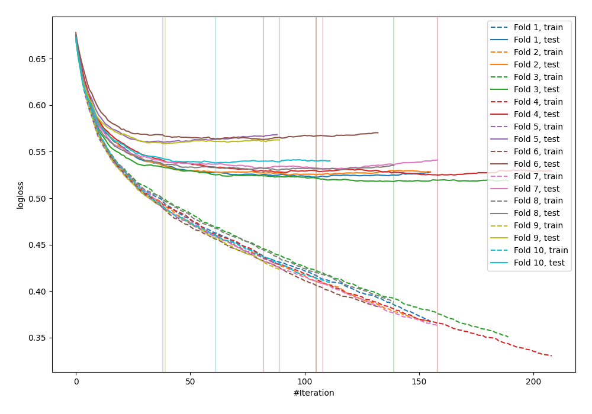

# Summary of 30_CatBoost

[<< Go back](../README.md)

## CatBoost
- **n_jobs**: -1
- **learning_rate**: 0.05
- **depth**: 8
- **rsm**: 0.8
- **loss_function**: Logloss
- **explain_level**: 0

## Validation
 - **validation_type**: kfold
 - **shuffle**: True
 - **stratify**: True
 - **k_folds**: 10

## Optimized metric
logloss

## Training time

38.9 seconds

## Metric details
|           |    score |    threshold |
|:----------|---------:|-------------:|
| logloss   | 0.537167 | nan          |
| auc       | 0.706842 | nan          |
| f1        | 0.545746 |   0.286889   |
| accuracy  | 0.706882 |   0.527568   |
| precision | 0.57868  |   0.527568   |
| recall    | 1        |   0.00421654 |
| mcc       | 0.301468 |   0.16915    |

## Confusion matrix (at threshold=0.527568)
|                     |   Predicted as negative |   Predicted as positive |
|:--------------------|------------------------:|------------------------:|
| Labeled as negative |                    2341 |                      83 |
| Labeled as positive |                     935 |                     114 |

## Learning curves

[<< Go back](../README.md)
