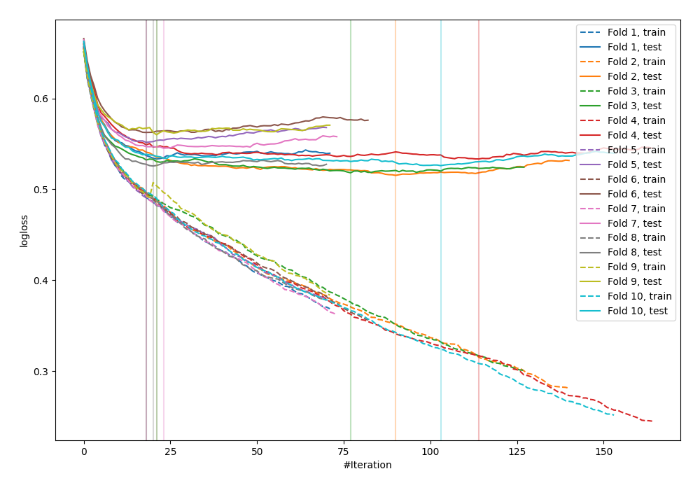

# Summary of 31_CatBoost

[<< Go back](../README.md)

## CatBoost
- **n_jobs**: -1
- **learning_rate**: 0.1
- **depth**: 8
- **rsm**: 1.0
- **loss_function**: Logloss
- **explain_level**: 0

## Validation
 - **validation_type**: kfold
 - **shuffle**: True
 - **stratify**: True
 - **k_folds**: 10

## Optimized metric
logloss

## Training time

30.9 seconds

## Metric details
|           |    score |    threshold |
|:----------|---------:|-------------:|
| logloss   | 0.537192 | nan          |
| auc       | 0.710395 | nan          |
| f1        | 0.551822 |   0.223628   |
| accuracy  | 0.70429  |   0.513894   |
| precision | 0.542969 |   0.513894   |
| recall    | 1        |   0.00120623 |
| mcc       | 0.313119 |   0.212589   |

## Confusion matrix (at threshold=0.513894)
|                     |   Predicted as negative |   Predicted as positive |
|:--------------------|------------------------:|------------------------:|
| Labeled as negative |                    2307 |                     117 |
| Labeled as positive |                     910 |                     139 |

## Learning curves

[<< Go back](../README.md)
