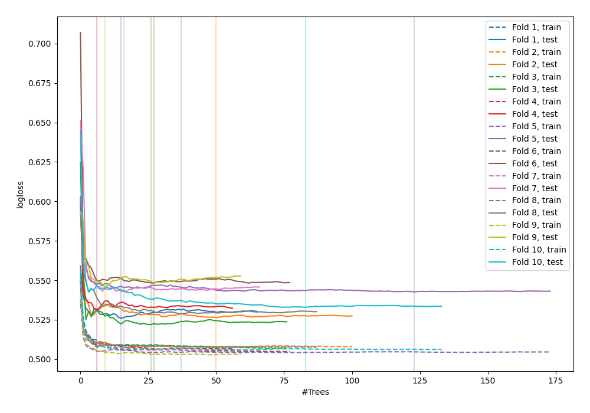

# Summary of 39_RandomForest

[<< Go back](../README.md)

## Random Forest
- **n_jobs**: -1
- **criterion**: gini
- **max_features**: 0.5
- **min_samples_split**: 20
- **max_depth**: 4
- **explain_level**: 0

## Validation
 - **validation_type**: kfold
 - **shuffle**: True
 - **stratify**: True
 - **k_folds**: 10

## Optimized metric
logloss

## Training time

21.2 seconds

## Metric details
|           |    score |    threshold |
|:----------|---------:|-------------:|
| logloss   | 0.534604 | nan          |
| auc       | 0.707516 | nan          |
| f1        | 0.547212 |   0.30947    |
| accuracy  | 0.701987 |   0.474696   |
| precision | 0.529851 |   0.509796   |
| recall    | 1        |   0.00268003 |
| mcc       | 0.294384 |   0.220721   |

## Confusion matrix (at threshold=0.474696)
|                     |   Predicted as negative |   Predicted as positive |
|:--------------------|------------------------:|------------------------:|
| Labeled as negative |                    2260 |                     164 |
| Labeled as positive |                     871 |                     178 |

## Learning curves

[<< Go back](../README.md)
