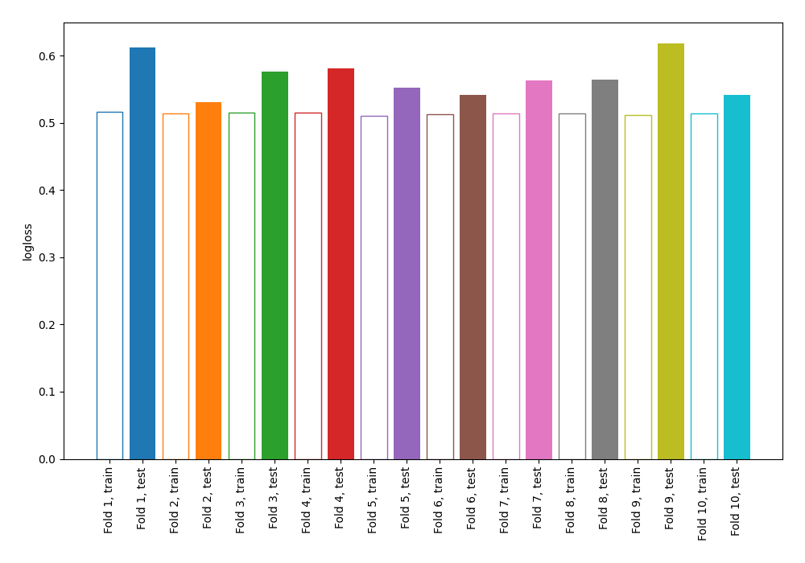

# Summary of 3_DecisionTree

[<< Go back](../README.md)

## Decision Tree
- **n_jobs**: -1
- **criterion**: gini
- **max_depth**: 4
- **explain_level**: 0

## Validation
 - **validation_type**: kfold
 - **shuffle**: True
 - **stratify**: True
 - **k_folds**: 10

## Optimized metric
logloss

## Training time

2.2 seconds

## Metric details
|           |    score |   threshold |
|:----------|---------:|------------:|
| logloss   | 0.568146 |  nan        |
| auc       | 0.692897 |  nan        |
| f1        | 0.535189 |    0.126656 |
| accuracy  | 0.697668 |    0.68283  |
| precision | 0.481481 |    0.68283  |
| recall    | 0.998093 |    0        |
| mcc       | 0.2881   |    0.126656 |

## Confusion matrix (at threshold=0.68283)
|                     |   Predicted as negative |   Predicted as positive |
|:--------------------|------------------------:|------------------------:|
| Labeled as negative |                    2410 |                      14 |
| Labeled as positive |                    1036 |                      13 |

## Learning curves

[<< Go back](../README.md)
