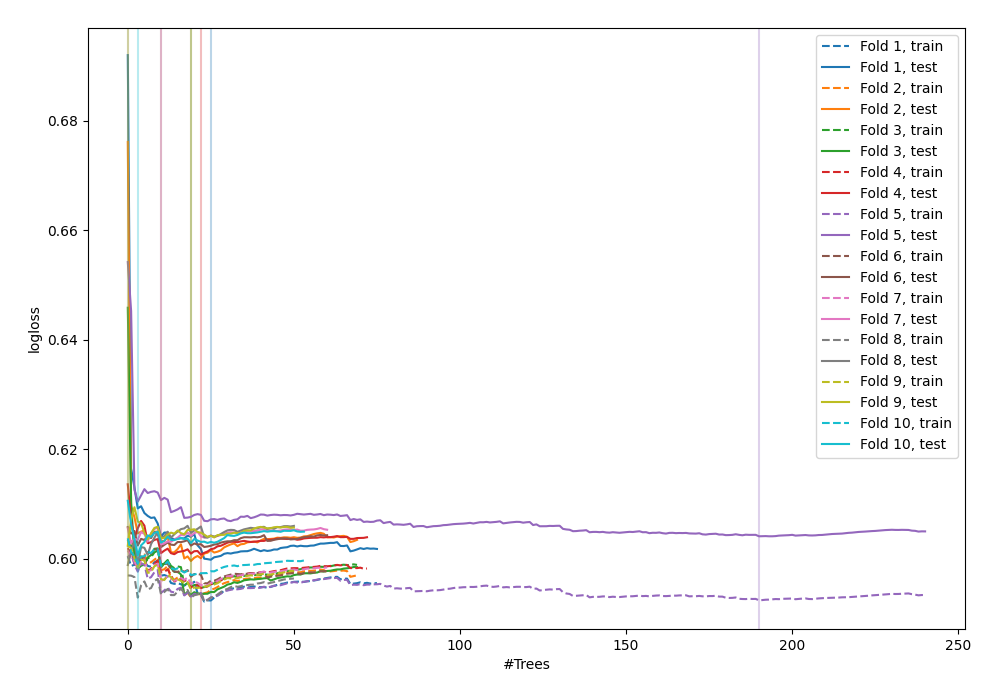

# Summary of 48_ExtraTrees

[<< Go back](../README.md)

## Extra Trees Classifier (Extra Trees)
- **n_jobs**: -1
- **criterion**: gini
- **max_features**: 0.5
- **min_samples_split**: 20
- **max_depth**: 4
- **explain_level**: 0

## Validation
 - **validation_type**: kfold
 - **shuffle**: True
 - **stratify**: True
 - **k_folds**: 10

## Optimized metric
logloss

## Training time

10.5 seconds

## Metric details
|           |    score |   threshold |
|:----------|---------:|------------:|
| logloss   | 0.60039  |  nan        |
| auc       | 0.62304  |  nan        |
| f1        | 0.497341 |    0.29916  |
| accuracy  | 0.69738  |    0.361308 |
| precision | 0.49     |    0.361308 |
| recall    | 1        |    0.018    |
| mcc       | 0.19199  |    0.301787 |

## Confusion matrix (at threshold=0.361308)
|                     |   Predicted as negative |   Predicted as positive |
|:--------------------|------------------------:|------------------------:|
| Labeled as negative |                    2373 |                      51 |
| Labeled as positive |                    1000 |                      49 |

## Learning curves

[<< Go back](../README.md)
