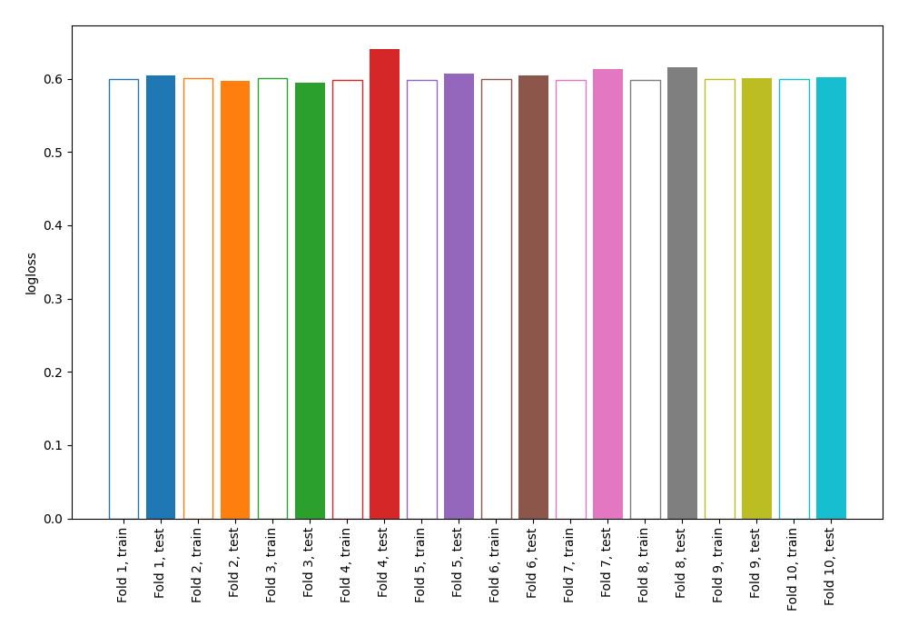

# Summary of 4_Linear

[<< Go back](../README.md)

## Logistic Regression (Linear)
- **n_jobs**: -1
- **explain_level**: 0

## Validation
 - **validation_type**: kfold
 - **shuffle**: True
 - **stratify**: True
 - **k_folds**: 10

## Optimized metric
logloss

## Training time

5.8 seconds

## Metric details
|           |    score |     threshold |
|:----------|---------:|--------------:|
| logloss   | 0.60794  | nan           |
| auc       | 0.614036 | nan           |
| f1        | 0.48433  |   0.294675    |
| accuracy  | 0.697092 |   0.593991    |
| precision | 0.424403 |   0.327939    |
| recall    | 1        |   3.86851e-09 |
| mcc       | 0.167254 |   0.299414    |

## Confusion matrix (at threshold=0.593991)
|                     |   Predicted as negative |   Predicted as positive |
|:--------------------|------------------------:|------------------------:|
| Labeled as negative |                    2415 |                       9 |
| Labeled as positive |                    1043 |                       6 |

## Learning curves

[<< Go back](../README.md)
