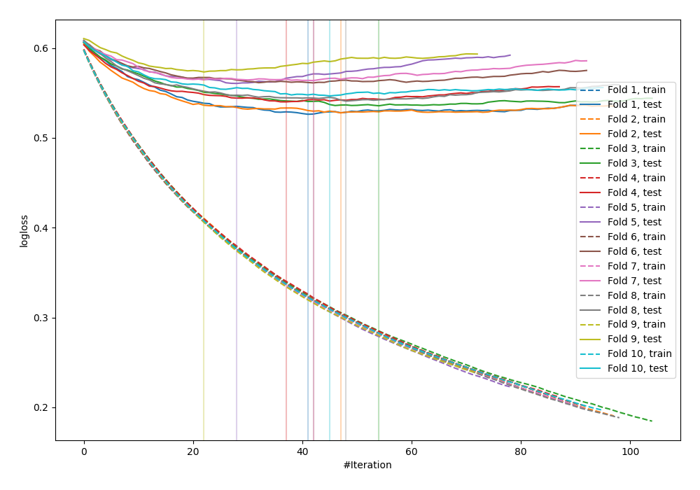

# Summary of 5_Default_LightGBM

[<< Go back](../README.md)

## LightGBM
- **n_jobs**: -1
- **objective**: binary
- **metric**: binary_logloss
- **num_leaves**: 63
- **learning_rate**: 0.05
- **feature_fraction**: 0.9
- **bagging_fraction**: 0.9
- **min_data_in_leaf**: 10
- **explain_level**: 0

## Validation
 - **validation_type**: kfold
 - **shuffle**: True
 - **stratify**: True
 - **k_folds**: 10

## Optimized metric
logloss

## Training time

6.9 seconds

## Metric details
|           |    score |   threshold |
|:----------|---------:|------------:|
| logloss   | 0.547631 |  nan        |
| auc       | 0.698283 |  nan        |
| f1        | 0.543472 |    0.207307 |
| accuracy  | 0.700259 |    0.572046 |
| precision | 0.531646 |    0.623217 |
| recall    | 1        |    0.018278 |
| mcc       | 0.301203 |    0.147297 |

## Confusion matrix (at threshold=0.572046)
|                     |   Predicted as negative |   Predicted as positive |
|:--------------------|------------------------:|------------------------:|
| Labeled as negative |                    2335 |                      89 |
| Labeled as positive |                     952 |                      97 |

## Learning curves

[<< Go back](../README.md)
