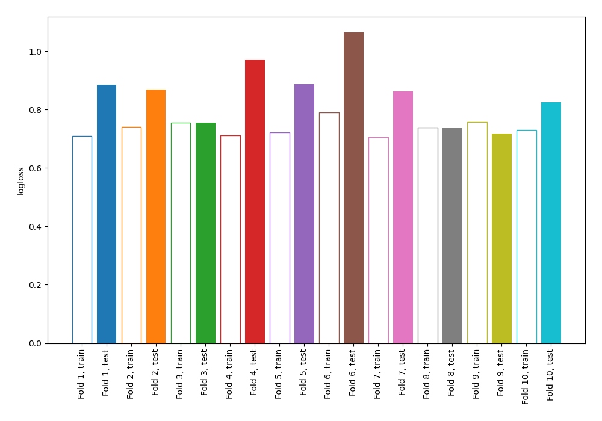

# Summary of 66_NearestNeighbors

[<< Go back](../README.md)

## k-Nearest Neighbors (Nearest Neighbors)
- **n_jobs**: -1
- **n_neighbors**: 7
- **weights**: uniform
- **explain_level**: 0

## Validation
 - **validation_type**: kfold
 - **shuffle**: True
 - **stratify**: True
 - **k_folds**: 10

## Optimized metric
logloss

## Training time

3.2 seconds

## Metric details
|           |    score |   threshold |
|:----------|---------:|------------:|
| logloss   | 0.857671 |  nan        |
| auc       | 0.597625 |  nan        |
| f1        | 0.47842  |    0        |
| accuracy  | 0.68903  |    0.571429 |
| precision | 0.410405 |    0.571429 |
| recall    | 0.935176 |    0        |
| mcc       | 0.138901 |    0.357143 |

## Confusion matrix (at threshold=0.571429)
|                     |   Predicted as negative |   Predicted as positive |
|:--------------------|------------------------:|------------------------:|
| Labeled as negative |                    2322 |                     102 |
| Labeled as positive |                     978 |                      71 |

## Learning curves

[<< Go back](../README.md)
