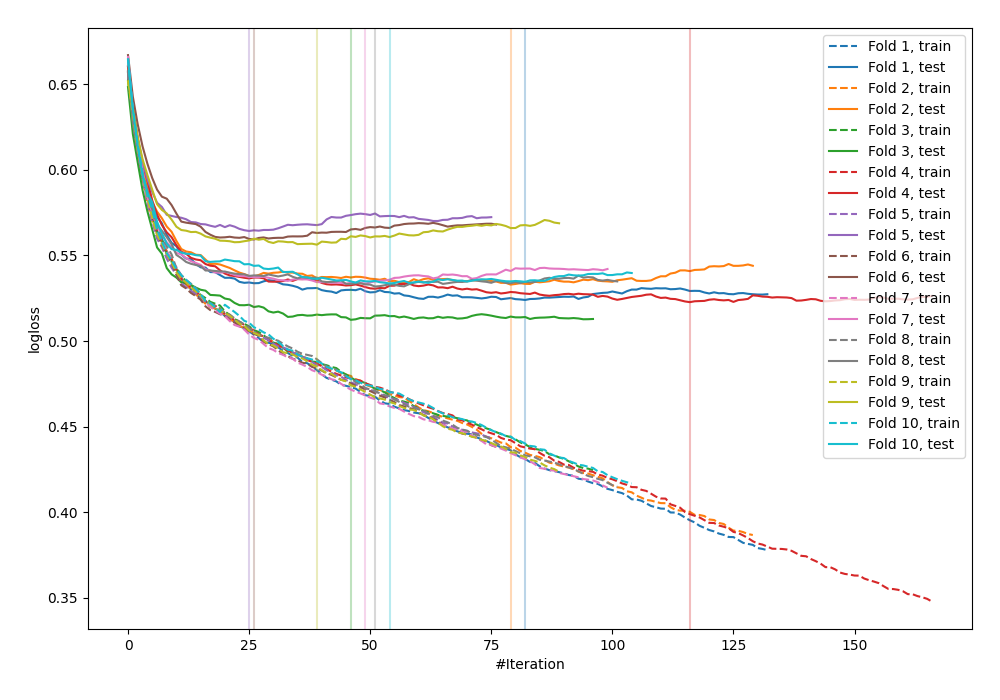

# Summary of 7_Default_CatBoost

[<< Go back](../README.md)

## CatBoost
- **n_jobs**: -1
- **learning_rate**: 0.1
- **depth**: 6
- **rsm**: 1
- **loss_function**: Logloss
- **explain_level**: 0

## Validation
 - **validation_type**: kfold
 - **shuffle**: True
 - **stratify**: True
 - **k_folds**: 10

## Optimized metric
logloss

## Training time

12.8 seconds

## Metric details
|           |    score |    threshold |
|:----------|---------:|-------------:|
| logloss   | 0.537095 | nan          |
| auc       | 0.706579 | nan          |
| f1        | 0.546156 |   0.288233   |
| accuracy  | 0.700547 |   0.613626   |
| precision | 0.621622 |   0.613626   |
| recall    | 1        |   0.00166847 |
| mcc       | 0.301049 |   0.177041   |

## Confusion matrix (at threshold=0.613626)
|                     |   Predicted as negative |   Predicted as positive |
|:--------------------|------------------------:|------------------------:|
| Labeled as negative |                    2410 |                      14 |
| Labeled as positive |                    1026 |                      23 |

## Learning curves

[<< Go back](../README.md)
