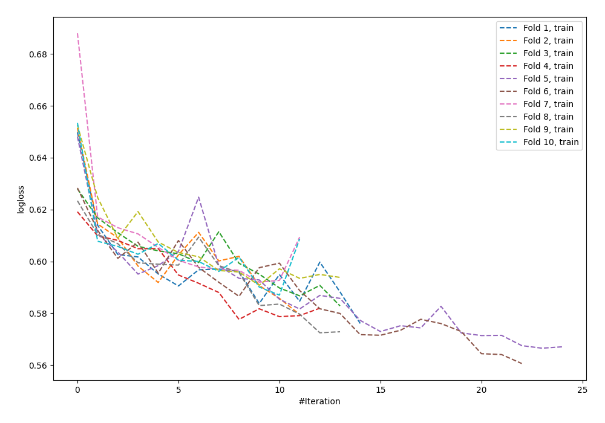

# Summary of 8_Default_NeuralNetwork

[<< Go back](../README.md)

## Neural Network
- **n_jobs**: -1
- **dense_1_size**: 32
- **dense_2_size**: 16
- **learning_rate**: 0.05
- **explain_level**: 0

## Validation
 - **validation_type**: kfold
 - **shuffle**: True
 - **stratify**: True
 - **k_folds**: 10

## Optimized metric
logloss

## Training time

7.3 seconds

## Metric details
|           |    score |      threshold |
|:----------|---------:|---------------:|
| logloss   | 0.610006 | nan            |
| auc       | 0.559254 | nan            |
| f1        | 0.475802 |   0.219329     |
| accuracy  | 0.697668 |   0.498214     |
| precision | 0.444444 |   0.498214     |
| recall    | 1        |   2.46488e-101 |
| mcc       | 0.108142 |   0.219329     |

## Confusion matrix (at threshold=0.498214)
|                     |   Predicted as negative |   Predicted as positive |
|:--------------------|------------------------:|------------------------:|
| Labeled as negative |                    2419 |                       5 |
| Labeled as positive |                    1045 |                       4 |

## Learning curves

[<< Go back](../README.md)
