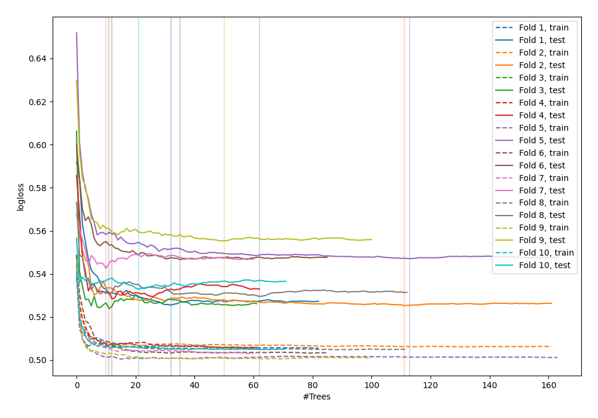

# Summary of 9_Default_RandomForest

[<< Go back](../README.md)

## Random Forest
- **n_jobs**: -1
- **criterion**: gini
- **max_features**: 0.9
- **min_samples_split**: 30
- **max_depth**: 4
- **explain_level**: 0

## Validation
 - **validation_type**: kfold
 - **shuffle**: True
 - **stratify**: True
 - **k_folds**: 10

## Optimized metric
logloss

## Training time

23.4 seconds

## Metric details
|           |    score |    threshold |
|:----------|---------:|-------------:|
| logloss   | 0.535706 | nan          |
| auc       | 0.706225 | nan          |
| f1        | 0.54658  |   0.293779   |
| accuracy  | 0.701411 |   0.454809   |
| precision | 0.512821 |   0.454809   |
| recall    | 1        |   0.00567254 |
| mcc       | 0.29497  |   0.201744   |

## Confusion matrix (at threshold=0.454809)
|                     |   Predicted as negative |   Predicted as positive |
|:--------------------|------------------------:|------------------------:|
| Labeled as negative |                    2196 |                     228 |
| Labeled as positive |                     809 |                     240 |

## Learning curves

[<< Go back](../README.md)
