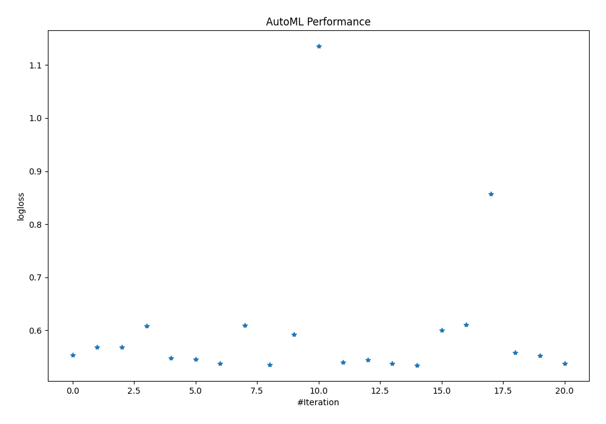
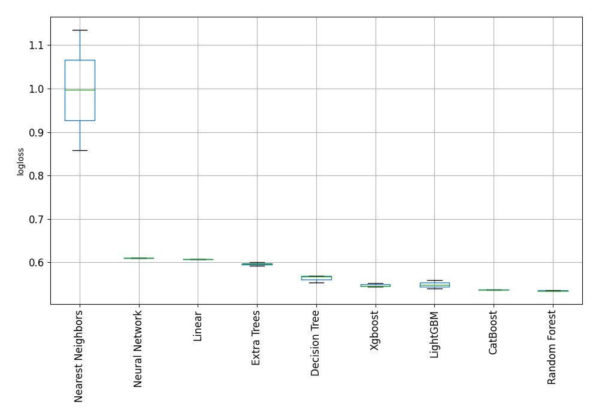

# AutoML Leaderboard

| Best model   | name                                                                 | model_type        | metric_type   |   metric_value |   train_time |
|:-------------|:---------------------------------------------------------------------|:------------------|:--------------|---------------:|-------------:|
|              | [1_DecisionTree](1_DecisionTree/README.md)                           | Decision Tree     | logloss       |       0.553303 |         2.52 |
|              | [2_DecisionTree](2_DecisionTree/README.md)                           | Decision Tree     | logloss       |       0.568971 |         2.52 |
|              | [3_DecisionTree](3_DecisionTree/README.md)                           | Decision Tree     | logloss       |       0.568146 |         2.5  |
|              | [4_Linear](4_Linear/README.md)                                       | Linear            | logloss       |       0.60794  |         6.18 |
|              | [5_Default_LightGBM](5_Default_LightGBM/README.md)                   | LightGBM          | logloss       |       0.547631 |         7.38 |
|              | [6_Default_Xgboost](6_Default_Xgboost/README.md)                     | Xgboost           | logloss       |       0.545796 |        13.05 |
|              | [7_Default_CatBoost](7_Default_CatBoost/README.md)                   | CatBoost          | logloss       |       0.537095 |        13.32 |
|              | [8_Default_NeuralNetwork](8_Default_NeuralNetwork/README.md)         | Neural Network    | logloss       |       0.610006 |         7.7  |
|              | [9_Default_RandomForest](9_Default_RandomForest/README.md)           | Random Forest     | logloss       |       0.535706 |        23.91 |
|              | [10_Default_ExtraTrees](10_Default_ExtraTrees/README.md)             | Extra Trees       | logloss       |       0.592587 |        15.15 |
|              | [11_Default_NearestNeighbors](11_Default_NearestNeighbors/README.md) | Nearest Neighbors | logloss       |       1.13536  |         3.45 |
|              | [21_LightGBM](21_LightGBM/README.md)                                 | LightGBM          | logloss       |       0.539597 |         3.8  |
|              | [12_Xgboost](12_Xgboost/README.md)                                   | Xgboost           | logloss       |       0.544675 |        13.91 |
|              | [30_CatBoost](30_CatBoost/README.md)                                 | CatBoost          | logloss       |       0.537167 |        39.37 |
| **the best** | [39_RandomForest](39_RandomForest/README.md)                         | Random Forest     | logloss       |       0.534604 |        21.72 |
|              | [48_ExtraTrees](48_ExtraTrees/README.md)                             | Extra Trees       | logloss       |       0.60039  |        11.04 |
|              | [57_NeuralNetwork](57_NeuralNetwork/README.md)                       | Neural Network    | logloss       |       0.610507 |         7.25 |
|              | [66_NearestNeighbors](66_NearestNeighbors/README.md)                 | Nearest Neighbors | logloss       |       0.857671 |         3.52 |
|              | [22_LightGBM](22_LightGBM/README.md)                                 | LightGBM          | logloss       |       0.558649 |         4.71 |
|              | [13_Xgboost](13_Xgboost/README.md)                                   | Xgboost           | logloss       |       0.552422 |        17.2  |
|              | [31_CatBoost](31_CatBoost/README.md)                                 | CatBoost          | logloss       |       0.537192 |        31.29 |

### AutoML Performance

### AutoML Performance Boxplot
