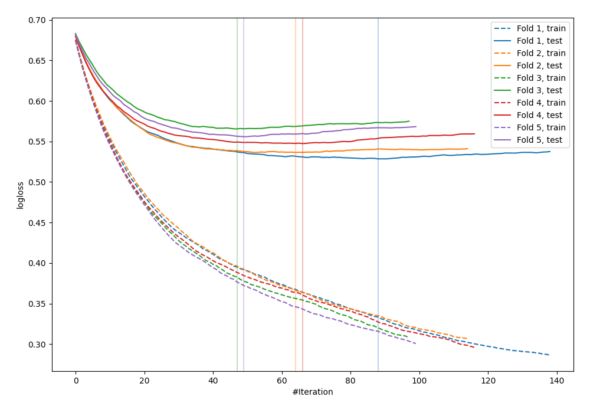

# Summary of 10_Xgboost

[<< Go back](../README.md)

## Extreme Gradient Boosting (Xgboost)
- **n_jobs**: -1
- **objective**: binary:logistic
- **eval_metric**: logloss
- **eta**: 0.05
- **max_depth**: 8
- **min_child_weight**: 5
- **subsample**: 1.0
- **colsample_bytree**: 1.0
- **explain_level**: 0

## Validation
 - **validation_type**: kfold
 - **shuffle**: True
 - **stratify**: True
 - **k_folds**: 5

## Optimized metric
logloss

## Training time

6.7 seconds

## Metric details
|           |    score |    threshold |
|:----------|---------:|-------------:|
| logloss   | 0.546746 | nan          |
| auc       | 0.698033 | nan          |
| f1        | 0.546598 |   0.220851   |
| accuracy  | 0.697092 |   0.637224   |
| precision | 0.487544 |   0.561953   |
| recall    | 1        |   0.00689194 |
| mcc       | 0.304788 |   0.182205   |

## Confusion matrix (at threshold=0.637224)
|                     |   Predicted as negative |   Predicted as positive |
|:--------------------|------------------------:|------------------------:|
| Labeled as negative |                    2374 |                      50 |
| Labeled as positive |                    1002 |                      47 |

## Learning curves

[<< Go back](../README.md)
