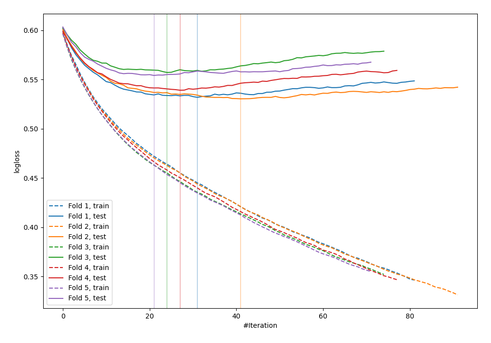

# Summary of 19_LightGBM

[<< Go back](../README.md)

## LightGBM
- **n_jobs**: -1
- **objective**: binary
- **metric**: binary_logloss
- **num_leaves**: 15
- **learning_rate**: 0.1
- **feature_fraction**: 0.8
- **bagging_fraction**: 0.8
- **min_data_in_leaf**: 10
- **explain_level**: 0

## Validation
 - **validation_type**: kfold
 - **shuffle**: True
 - **stratify**: True
 - **k_folds**: 5

## Optimized metric
logloss

## Training time

2.2 seconds

## Metric details
|           |    score |    threshold |
|:----------|---------:|-------------:|
| logloss   | 0.542519 | nan          |
| auc       | 0.697121 | nan          |
| f1        | 0.542233 |   0.284064   |
| accuracy  | 0.69594  |   0.572193   |
| precision | 0.477954 |   0.457707   |
| recall    | 1        |   0.00664903 |
| mcc       | 0.297777 |   0.163842   |

## Confusion matrix (at threshold=0.572193)
|                     |   Predicted as negative |   Predicted as positive |
|:--------------------|------------------------:|------------------------:|
| Labeled as negative |                    2373 |                      51 |
| Labeled as positive |                    1005 |                      44 |

## Learning curves

[<< Go back](../README.md)
