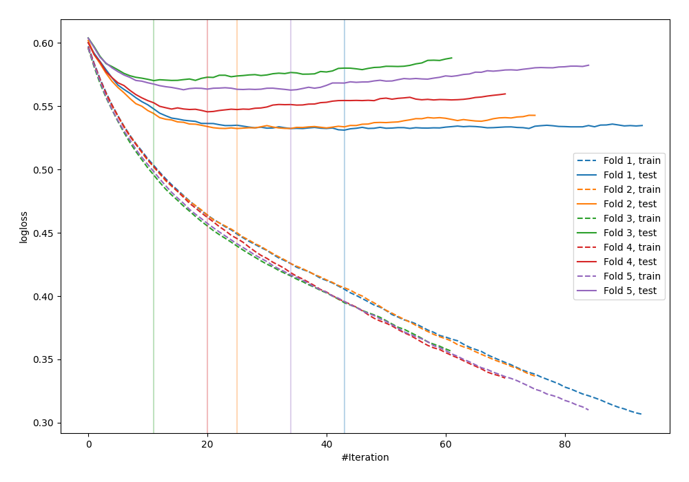

# Summary of 19_LightGBM_Stacked

[<< Go back](../README.md)

## LightGBM
- **n_jobs**: -1
- **objective**: binary
- **metric**: binary_logloss
- **num_leaves**: 15
- **learning_rate**: 0.1
- **feature_fraction**: 0.8
- **bagging_fraction**: 0.8
- **min_data_in_leaf**: 10
- **explain_level**: 0

## Validation
 - **validation_type**: kfold
 - **shuffle**: True
 - **stratify**: True
 - **k_folds**: 5

## Optimized metric
logloss

## Training time

2.4 seconds

## Metric details
|           |    score |    threshold |
|:----------|---------:|-------------:|
| logloss   | 0.54838  | nan          |
| auc       | 0.686562 | nan          |
| f1        | 0.544493 |   0.253924   |
| accuracy  | 0.693349 |   0.498468   |
| precision | 0.476562 |   0.48259    |
| recall    | 1        |   0.00452476 |
| mcc       | 0.293755 |   0.200788   |

## Confusion matrix (at threshold=0.498468)
|                     |   Predicted as negative |   Predicted as positive |
|:--------------------|------------------------:|------------------------:|
| Labeled as negative |                    2262 |                     162 |
| Labeled as positive |                     903 |                     146 |

## Learning curves

[<< Go back](../README.md)
