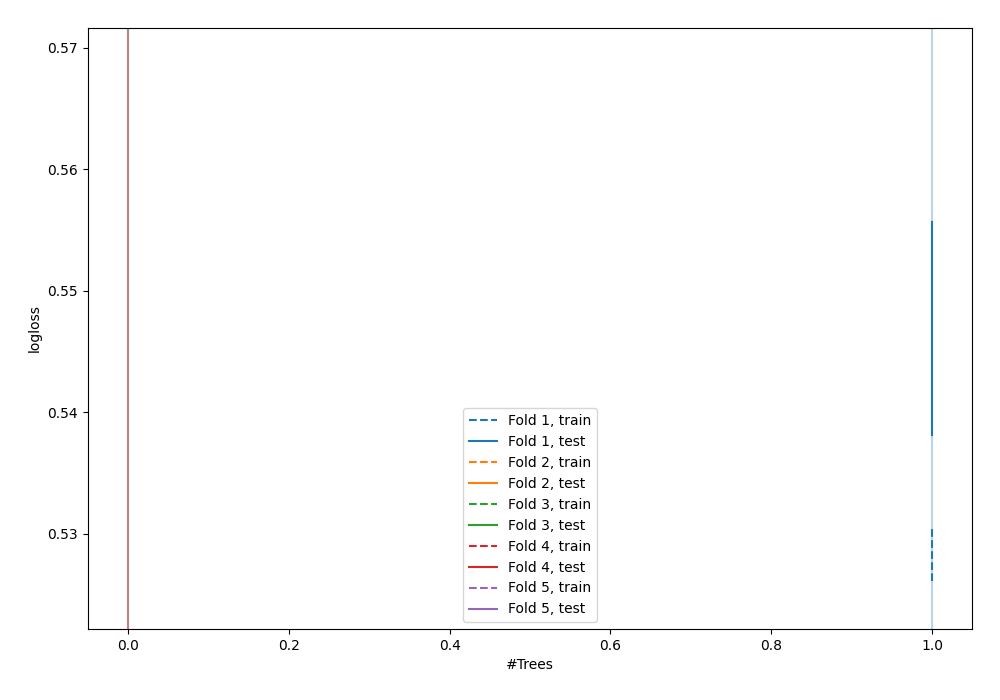

# Summary of 1_DecisionTree

[<< Go back](../README.md)

## Decision Tree
- **n_jobs**: -1
- **criterion**: gini
- **max_depth**: 3
- **explain_level**: 0

## Validation
 - **validation_type**: kfold
 - **shuffle**: True
 - **stratify**: True
 - **k_folds**: 5

## Optimized metric
logloss

## Training time

1.9 seconds

## Metric details
|           |    score |    threshold |
|:----------|---------:|-------------:|
| logloss   | 0.55683  | nan          |
| auc       | 0.682832 | nan          |
| f1        | 0.533078 |   0.238169   |
| accuracy  | 0.696228 |   0.679429   |
| precision | 0.454435 |   0.444575   |
| recall    | 1        |   0.00192308 |
| mcc       | 0.278509 |   0.105726   |

## Confusion matrix (at threshold=0.679429)
|                     |   Predicted as negative |   Predicted as positive |
|:--------------------|------------------------:|------------------------:|
| Labeled as negative |                    2415 |                       9 |
| Labeled as positive |                    1046 |                       3 |

## Learning curves

[<< Go back](../README.md)
