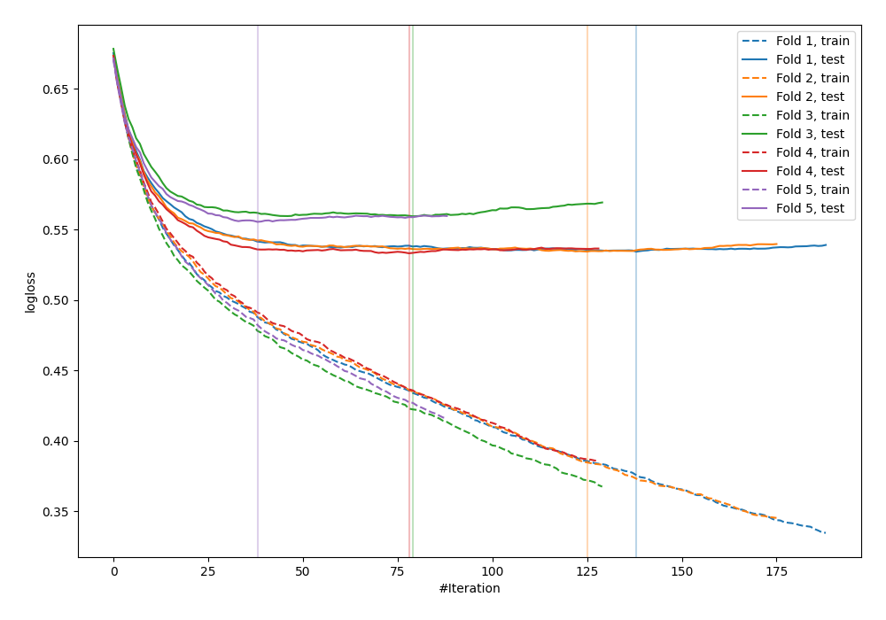

# Summary of 28_CatBoost

[<< Go back](../README.md)

## CatBoost
- **n_jobs**: -1
- **learning_rate**: 0.05
- **depth**: 8
- **rsm**: 0.8
- **loss_function**: Logloss
- **explain_level**: 0

## Validation
 - **validation_type**: kfold
 - **shuffle**: True
 - **stratify**: True
 - **k_folds**: 5

## Optimized metric
logloss

## Training time

20.3 seconds

## Metric details
|           |    score |    threshold |
|:----------|---------:|-------------:|
| logloss   | 0.543377 | nan          |
| auc       | 0.697783 | nan          |
| f1        | 0.543896 |   0.247702   |
| accuracy  | 0.700547 |   0.528534   |
| precision | 0.523077 |   0.528534   |
| recall    | 1        |   0.00337187 |
| mcc       | 0.297377 |   0.158244   |

## Confusion matrix (at threshold=0.528534)
|                     |   Predicted as negative |   Predicted as positive |
|:--------------------|------------------------:|------------------------:|
| Labeled as negative |                    2331 |                      93 |
| Labeled as positive |                     947 |                     102 |

## Learning curves

[<< Go back](../README.md)
