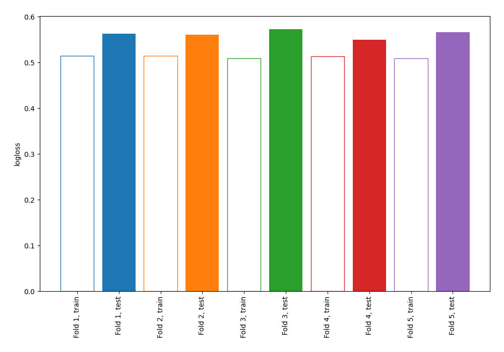

# Summary of 2_DecisionTree

[<< Go back](../README.md)

## Decision Tree
- **n_jobs**: -1
- **criterion**: gini
- **max_depth**: 4
- **explain_level**: 0

## Validation
 - **validation_type**: kfold
 - **shuffle**: True
 - **stratify**: True
 - **k_folds**: 5

## Optimized metric
logloss

## Training time

1.6 seconds

## Metric details
|           |    score |   threshold |
|:----------|---------:|------------:|
| logloss   | 0.562527 | nan         |
| auc       | 0.683824 | nan         |
| f1        | 0.535827 |   0.126344  |
| accuracy  | 0.69738  |   0.647959  |
| precision | 0.464286 |   0.647959  |
| recall    | 1        |   0         |
| mcc       | 0.292171 |   0.0909091 |

## Confusion matrix (at threshold=0.647959)
|                     |   Predicted as negative |   Predicted as positive |
|:--------------------|------------------------:|------------------------:|
| Labeled as negative |                    2409 |                      15 |
| Labeled as positive |                    1036 |                      13 |

## Learning curves

[<< Go back](../README.md)
