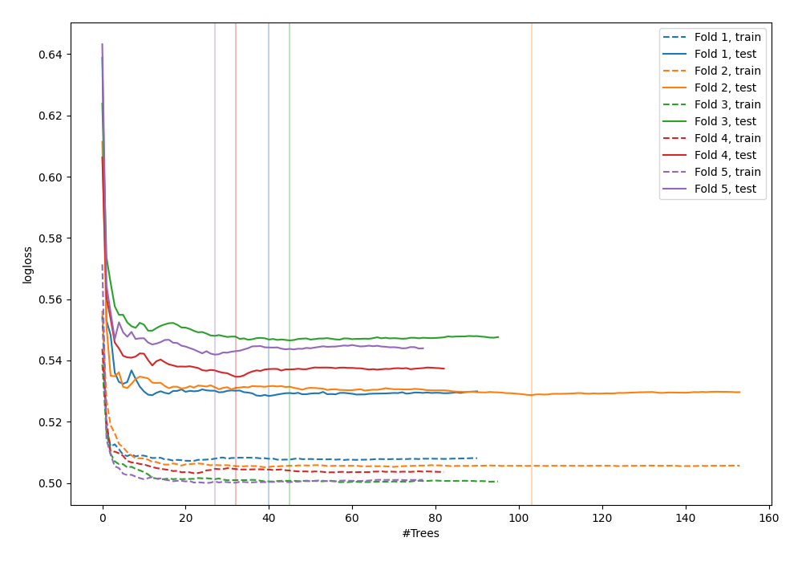

# Summary of 37_RandomForest

[<< Go back](../README.md)

## Random Forest
- **n_jobs**: -1
- **criterion**: gini
- **max_features**: 0.5
- **min_samples_split**: 20
- **max_depth**: 4
- **explain_level**: 0

## Validation
 - **validation_type**: kfold
 - **shuffle**: True
 - **stratify**: True
 - **k_folds**: 5

## Optimized metric
logloss

## Training time

10.1 seconds

## Metric details
|           |    score |    threshold |
|:----------|---------:|-------------:|
| logloss   | 0.536046 | nan          |
| auc       | 0.703735 | nan          |
| f1        | 0.547937 |   0.288039   |
| accuracy  | 0.701699 |   0.464133   |
| precision | 0.51752  |   0.464133   |
| recall    | 1        |   0.00388494 |
| mcc       | 0.29597  |   0.288039   |

## Confusion matrix (at threshold=0.464133)
|                     |   Predicted as negative |   Predicted as positive |
|:--------------------|------------------------:|------------------------:|
| Labeled as negative |                    2245 |                     179 |
| Labeled as positive |                     857 |                     192 |

## Learning curves

[<< Go back](../README.md)
