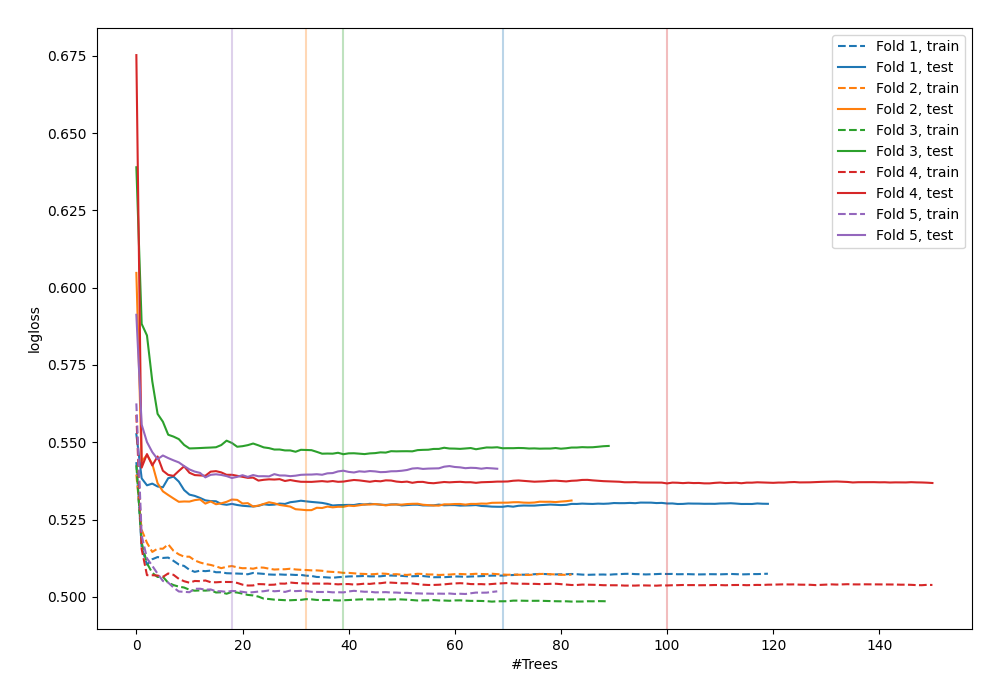

# Summary of 37_RandomForest_GoldenFeatures

[<< Go back](../README.md)

## Random Forest
- **n_jobs**: -1
- **criterion**: gini
- **max_features**: 0.5
- **min_samples_split**: 20
- **max_depth**: 4
- **explain_level**: 0

## Validation
 - **validation_type**: kfold
 - **shuffle**: True
 - **stratify**: True
 - **k_folds**: 5

## Optimized metric
logloss

## Training time

20.6 seconds

## Metric details
|           |    score |    threshold |
|:----------|---------:|-------------:|
| logloss   | 0.535696 | nan          |
| auc       | 0.703199 | nan          |
| f1        | 0.544587 |   0.287571   |
| accuracy  | 0.699683 |   0.466606   |
| precision | 0.508523 |   0.466606   |
| recall    | 1        |   0.00261086 |
| mcc       | 0.293998 |   0.213025   |

## Confusion matrix (at threshold=0.466606)
|                     |   Predicted as negative |   Predicted as positive |
|:--------------------|------------------------:|------------------------:|
| Labeled as negative |                    2251 |                     173 |
| Labeled as positive |                     870 |                     179 |

## Learning curves

[<< Go back](../README.md)
