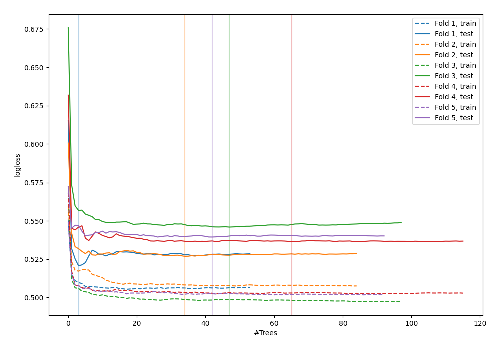

# Summary of 38_RandomForest_GoldenFeatures

[<< Go back](../README.md)

## Random Forest
- **n_jobs**: -1
- **criterion**: gini
- **max_features**: 0.6
- **min_samples_split**: 20
- **max_depth**: 4
- **explain_level**: 0

## Validation
 - **validation_type**: kfold
 - **shuffle**: True
 - **stratify**: True
 - **k_folds**: 5

## Optimized metric
logloss

## Training time

9.9 seconds

## Metric details
|           |    score |   threshold |
|:----------|---------:|------------:|
| logloss   | 0.533848 | nan         |
| auc       | 0.705042 | nan         |
| f1        | 0.548387 |   0.29708   |
| accuracy  | 0.697956 |   0.486913  |
| precision | 0.5      |   0.486913  |
| recall    | 1        |   0.0035919 |
| mcc       | 0.304095 |   0.237856  |

## Confusion matrix (at threshold=0.486913)
|                     |   Predicted as negative |   Predicted as positive |
|:--------------------|------------------------:|------------------------:|
| Labeled as negative |                    2271 |                     153 |
| Labeled as positive |                     896 |                     153 |

## Learning curves

[<< Go back](../README.md)
