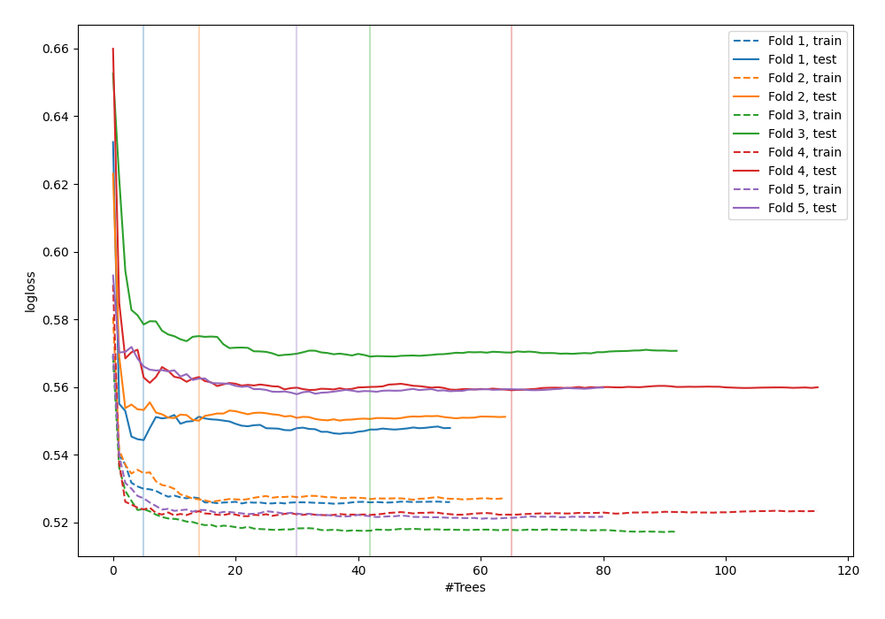

# Summary of 38_RandomForest_GoldenFeatures_BoostOnErrors

[<< Go back](../README.md)

## Random Forest
- **n_jobs**: -1
- **criterion**: gini
- **max_features**: 0.6
- **min_samples_split**: 20
- **max_depth**: 4
- **explain_level**: 0

## Validation
 - **validation_type**: kfold
 - **shuffle**: True
 - **stratify**: True
 - **k_folds**: 5

## Optimized metric
logloss

## Training time

9.6 seconds

## Metric details
|           |    score |    threshold |
|:----------|---------:|-------------:|
| logloss   | 0.536326 | nan          |
| auc       | 0.699305 | nan          |
| f1        | 0.548468 |   0.320371   |
| accuracy  | 0.701123 |   0.47737    |
| precision | 0.515235 |   0.483701   |
| recall    | 1        |   0.00227249 |
| mcc       | 0.302016 |   0.266183   |

## Confusion matrix (at threshold=0.47737)
|                     |   Predicted as negative |   Predicted as positive |
|:--------------------|------------------------:|------------------------:|
| Labeled as negative |                    2216 |                     208 |
| Labeled as positive |                     830 |                     219 |

## Learning curves

[<< Go back](../README.md)
