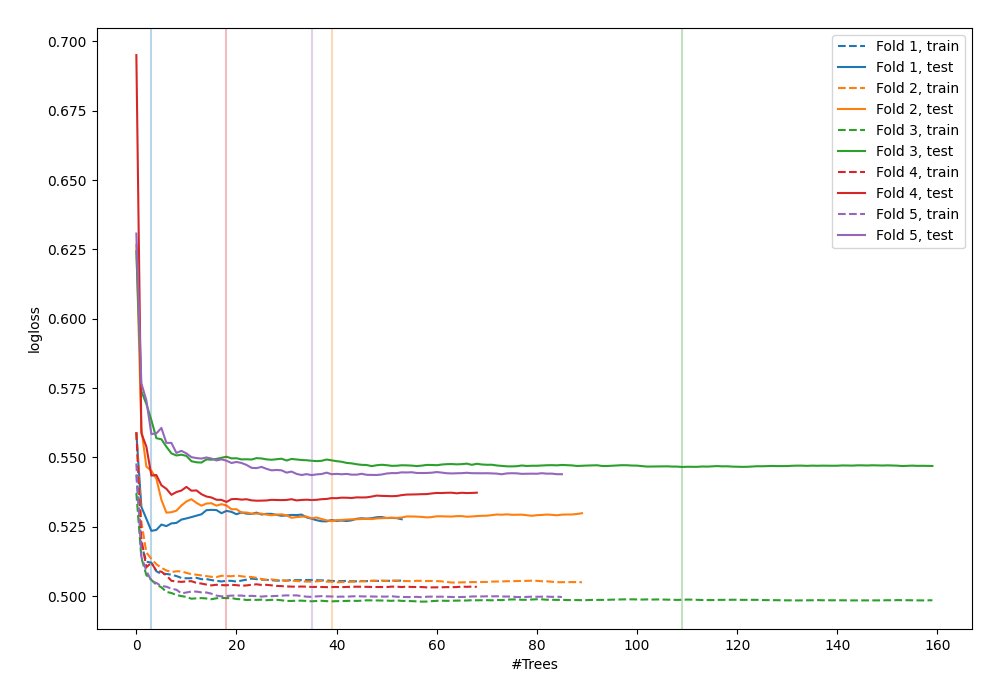

# Summary of 39_RandomForest

[<< Go back](../README.md)

## Random Forest
- **n_jobs**: -1
- **criterion**: gini
- **max_features**: 0.6
- **min_samples_split**: 20
- **max_depth**: 4
- **explain_level**: 0

## Validation
 - **validation_type**: kfold
 - **shuffle**: True
 - **stratify**: True
 - **k_folds**: 5

## Optimized metric
logloss

## Training time

8.8 seconds

## Metric details
|           |    score |   threshold |
|:----------|---------:|------------:|
| logloss   | 0.534966 |  nan        |
| auc       | 0.704013 |  nan        |
| f1        | 0.546561 |    0.28645  |
| accuracy  | 0.702851 |    0.469942 |
| precision | 0.521092 |    0.469942 |
| recall    | 1        |    0.004329 |
| mcc       | 0.299327 |    0.215856 |

## Confusion matrix (at threshold=0.469942)
|                     |   Predicted as negative |   Predicted as positive |
|:--------------------|------------------------:|------------------------:|
| Labeled as negative |                    2231 |                     193 |
| Labeled as positive |                     839 |                     210 |

## Learning curves

[<< Go back](../README.md)
