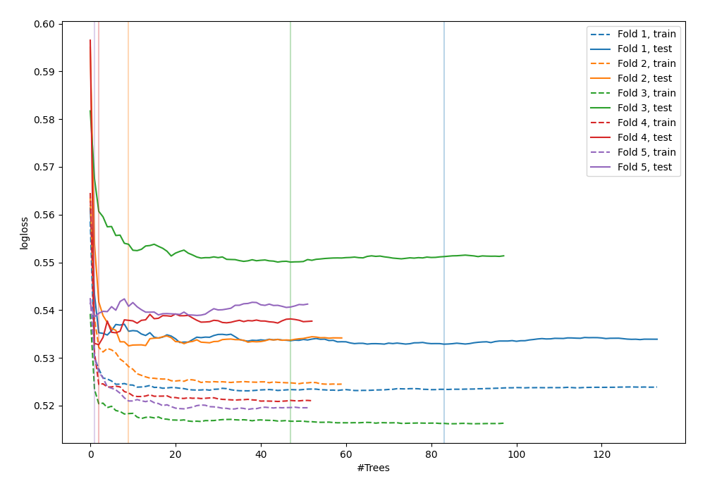

# Summary of 40_RandomForest_GoldenFeatures

[<< Go back](../README.md)

## Random Forest
- **n_jobs**: -1
- **criterion**: gini
- **max_features**: 0.6
- **min_samples_split**: 20
- **max_depth**: 3
- **explain_level**: 0

## Validation
 - **validation_type**: kfold
 - **shuffle**: True
 - **stratify**: True
 - **k_folds**: 5

## Optimized metric
logloss

## Training time

8.4 seconds

## Metric details
|           |    score |    threshold |
|:----------|---------:|-------------:|
| logloss   | 0.537365 | nan          |
| auc       | 0.696644 | nan          |
| f1        | 0.542056 |   0.284104   |
| accuracy  | 0.703138 |   0.460412   |
| precision | 0.525424 |   0.460412   |
| recall    | 1        |   0.00758953 |
| mcc       | 0.293675 |   0.218265   |

## Confusion matrix (at threshold=0.460412)
|                     |   Predicted as negative |   Predicted as positive |
|:--------------------|------------------------:|------------------------:|
| Labeled as negative |                    2256 |                     168 |
| Labeled as positive |                     863 |                     186 |

## Learning curves

[<< Go back](../README.md)
