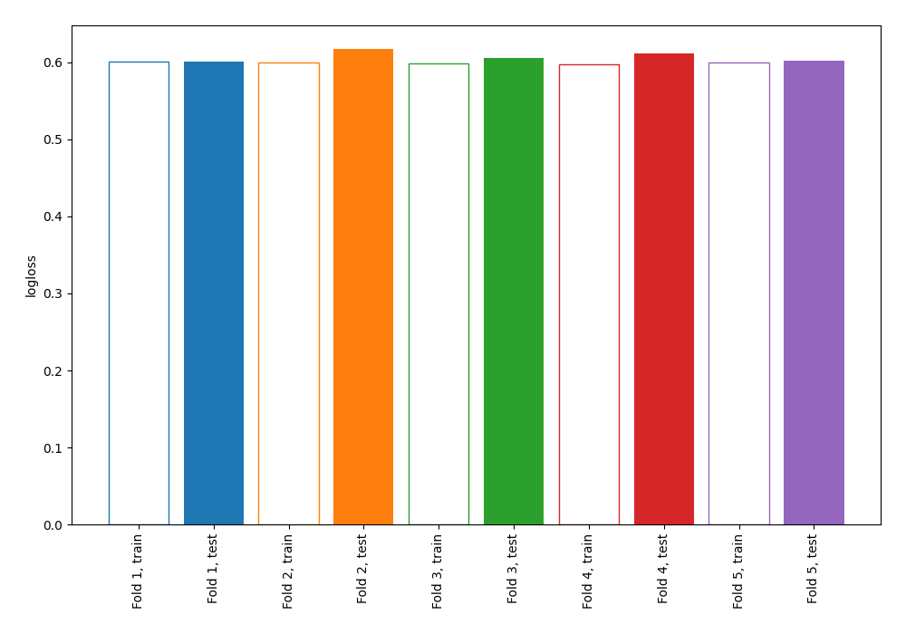

# Summary of 4_Linear

[<< Go back](../README.md)

## Logistic Regression (Linear)
- **n_jobs**: -1
- **explain_level**: 0

## Validation
 - **validation_type**: kfold
 - **shuffle**: True
 - **stratify**: True
 - **k_folds**: 5

## Optimized metric
logloss

## Training time

4.7 seconds

## Metric details
|           |    score |     threshold |
|:----------|---------:|--------------:|
| logloss   | 0.607262 | nan           |
| auc       | 0.612815 | nan           |
| f1        | 0.481556 |   0.284196    |
| accuracy  | 0.696804 |   0.592071    |
| precision | 0.42811  |   0.333205    |
| recall    | 1        |   2.94192e-08 |
| mcc       | 0.163438 |   0.308199    |

## Confusion matrix (at threshold=0.592071)
|                     |   Predicted as negative |   Predicted as positive |
|:--------------------|------------------------:|------------------------:|
| Labeled as negative |                    2415 |                       9 |
| Labeled as positive |                    1044 |                       5 |

## Learning curves

[<< Go back](../README.md)
