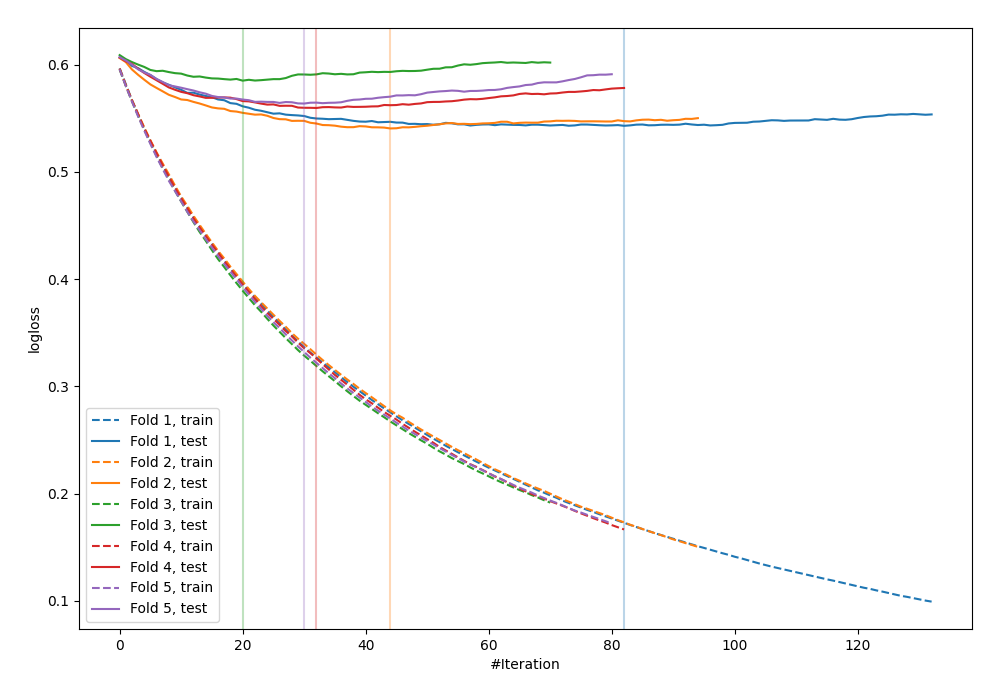

# Summary of 5_Default_LightGBM_Stacked

[<< Go back](../README.md)

## LightGBM
- **n_jobs**: -1
- **objective**: binary
- **metric**: binary_logloss
- **num_leaves**: 63
- **learning_rate**: 0.05
- **feature_fraction**: 0.9
- **bagging_fraction**: 0.9
- **min_data_in_leaf**: 10
- **explain_level**: 0

## Validation
 - **validation_type**: kfold
 - **shuffle**: True
 - **stratify**: True
 - **k_folds**: 5

## Optimized metric
logloss

## Training time

5.1 seconds

## Metric details
|           |    score |    threshold |
|:----------|---------:|-------------:|
| logloss   | 0.55848  | nan          |
| auc       | 0.678857 | nan          |
| f1        | 0.539069 |   0.2215     |
| accuracy  | 0.6945   |   0.55304    |
| precision | 0.466292 |   0.55304    |
| recall    | 1        |   0.00474154 |
| mcc       | 0.292998 |   0.120961   |

## Confusion matrix (at threshold=0.55304)
|                     |   Predicted as negative |   Predicted as positive |
|:--------------------|------------------------:|------------------------:|
| Labeled as negative |                    2329 |                      95 |
| Labeled as positive |                     966 |                      83 |

## Learning curves

[<< Go back](../README.md)
