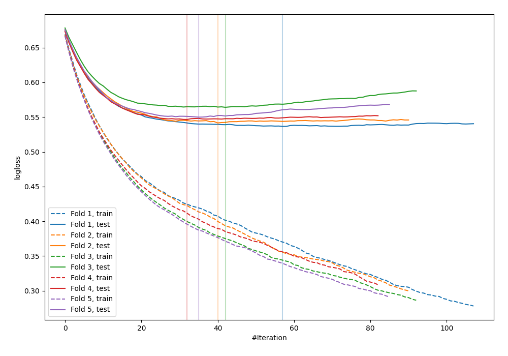

# Summary of 6_Default_Xgboost

[<< Go back](../README.md)

## Extreme Gradient Boosting (Xgboost)
- **n_jobs**: -1
- **objective**: binary:logistic
- **eval_metric**: logloss
- **eta**: 0.075
- **max_depth**: 6
- **min_child_weight**: 1
- **subsample**: 1.0
- **colsample_bytree**: 1.0
- **explain_level**: 0

## Validation
 - **validation_type**: kfold
 - **shuffle**: True
 - **stratify**: True
 - **k_folds**: 5

## Optimized metric
logloss

## Training time

6.3 seconds

## Metric details
|           |    score |    threshold |
|:----------|---------:|-------------:|
| logloss   | 0.547768 | nan          |
| auc       | 0.698447 | nan          |
| f1        | 0.551204 |   0.233701   |
| accuracy  | 0.693925 |   0.652235   |
| precision | 0.484193 |   0.48218    |
| recall    | 1        |   0.00638743 |
| mcc       | 0.30616  |   0.233701   |

## Confusion matrix (at threshold=0.652235)
|                     |   Predicted as negative |   Predicted as positive |
|:--------------------|------------------------:|------------------------:|
| Labeled as negative |                    2387 |                      37 |
| Labeled as positive |                    1026 |                      23 |

## Learning curves

[<< Go back](../README.md)
