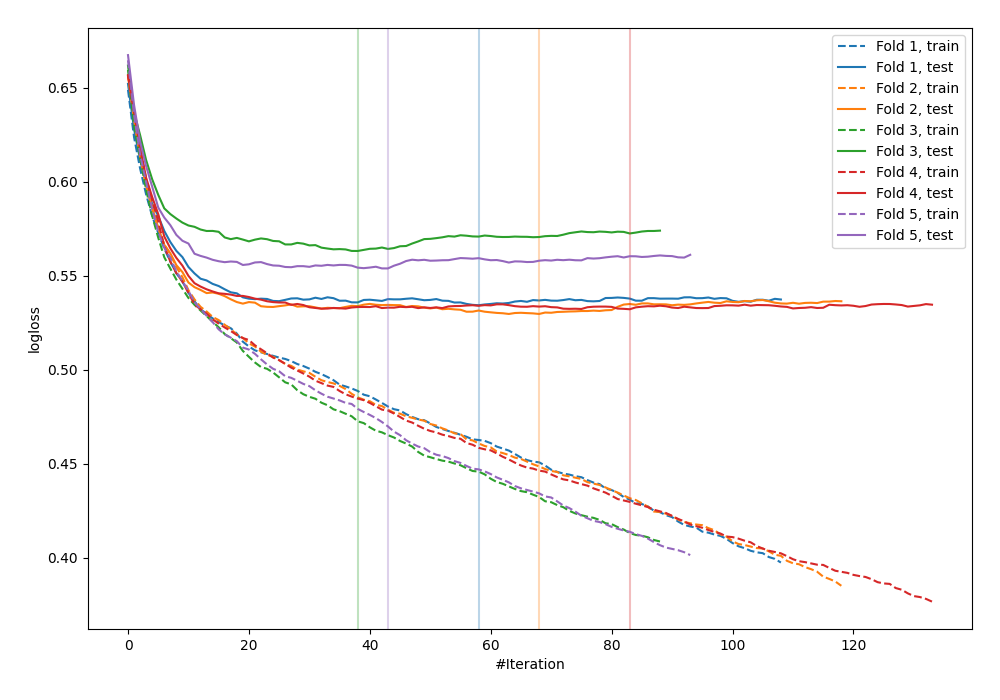

# Summary of 7_Default_CatBoost

[<< Go back](../README.md)

## CatBoost
- **n_jobs**: -1
- **learning_rate**: 0.1
- **depth**: 6
- **rsm**: 1
- **loss_function**: Logloss
- **explain_level**: 0

## Validation
 - **validation_type**: kfold
 - **shuffle**: True
 - **stratify**: True
 - **k_folds**: 5

## Optimized metric
logloss

## Training time

6.2 seconds

## Metric details
|           |    score |    threshold |
|:----------|---------:|-------------:|
| logloss   | 0.542705 | nan          |
| auc       | 0.695328 | nan          |
| f1        | 0.544493 |   0.242528   |
| accuracy  | 0.701123 |   0.513545   |
| precision | 0.522267 |   0.513545   |
| recall    | 1        |   0.00275513 |
| mcc       | 0.297071 |   0.14999    |

## Confusion matrix (at threshold=0.513545)
|                     |   Predicted as negative |   Predicted as positive |
|:--------------------|------------------------:|------------------------:|
| Labeled as negative |                    2306 |                     118 |
| Labeled as positive |                     920 |                     129 |

## Learning curves

[<< Go back](../README.md)
