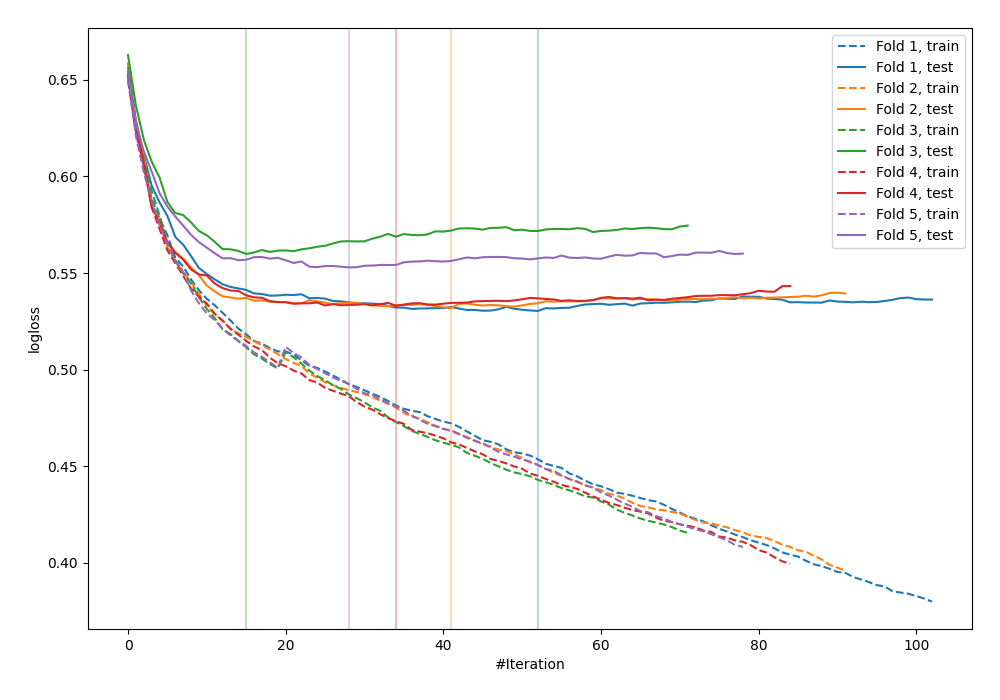

# Summary of 7_Default_CatBoost_Stacked

[<< Go back](../README.md)

## CatBoost
- **n_jobs**: -1
- **learning_rate**: 0.1
- **depth**: 6
- **rsm**: 1
- **loss_function**: Logloss
- **explain_level**: 0

## Validation
 - **validation_type**: kfold
 - **shuffle**: True
 - **stratify**: True
 - **k_folds**: 5

## Optimized metric
logloss

## Training time

6.9 seconds

## Metric details
|           |    score |    threshold |
|:----------|---------:|-------------:|
| logloss   | 0.541892 | nan          |
| auc       | 0.69867  | nan          |
| f1        | 0.547524 |   0.233651   |
| accuracy  | 0.697092 |   0.554115   |
| precision | 0.487952 |   0.497399   |
| recall    | 1        |   0.00667781 |
| mcc       | 0.30429  |   0.19531    |

## Confusion matrix (at threshold=0.554115)
|                     |   Predicted as negative |   Predicted as positive |
|:--------------------|------------------------:|------------------------:|
| Labeled as negative |                    2364 |                      60 |
| Labeled as positive |                     992 |                      57 |

## Learning curves

[<< Go back](../README.md)
