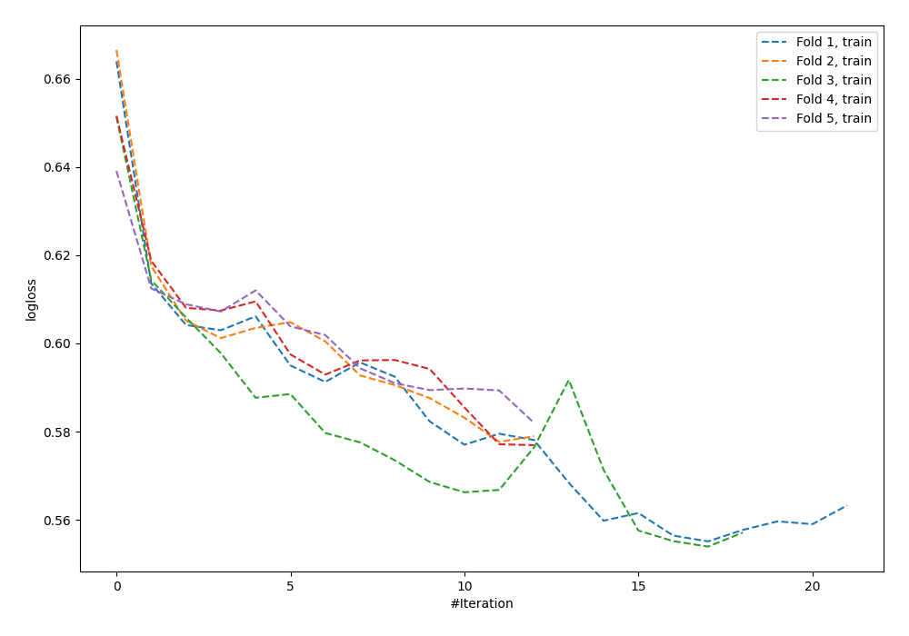

# Summary of 8_Default_NeuralNetwork

[<< Go back](../README.md)

## Neural Network
- **n_jobs**: -1
- **dense_1_size**: 32
- **dense_2_size**: 16
- **learning_rate**: 0.05
- **explain_level**: 0

## Validation
 - **validation_type**: kfold
 - **shuffle**: True
 - **stratify**: True
 - **k_folds**: 5

## Optimized metric
logloss

## Training time

3.8 seconds

## Metric details
|           |    score |      threshold |
|:----------|---------:|---------------:|
| logloss   | 0.606686 | nan            |
| auc       | 0.588625 | nan            |
| f1        | 0.478209 |   0.185283     |
| accuracy  | 0.694212 |   0.464619     |
| precision | 0.408269 |   0.404453     |
| recall    | 1        |   3.26641e-123 |
| mcc       | 0.125352 |   0.286369     |

## Confusion matrix (at threshold=0.464619)
|                     |   Predicted as negative |   Predicted as positive |
|:--------------------|------------------------:|------------------------:|
| Labeled as negative |                    2395 |                      29 |
| Labeled as positive |                    1033 |                      16 |

## Learning curves

[<< Go back](../README.md)
