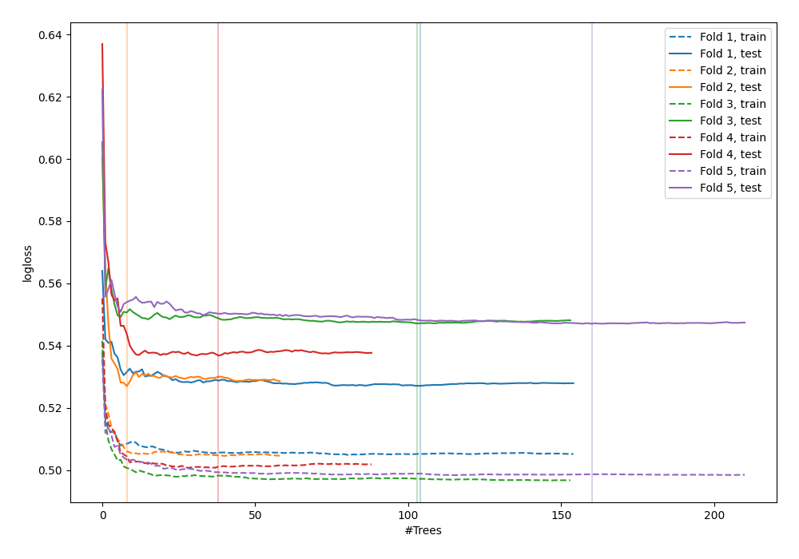

# Summary of 9_Default_RandomForest

[<< Go back](../README.md)

## Random Forest
- **n_jobs**: -1
- **criterion**: gini
- **max_features**: 0.9
- **min_samples_split**: 30
- **max_depth**: 4
- **explain_level**: 0

## Validation
 - **validation_type**: kfold
 - **shuffle**: True
 - **stratify**: True
 - **k_folds**: 5

## Optimized metric
logloss

## Training time

14.4 seconds

## Metric details
|           |    score |    threshold |
|:----------|---------:|-------------:|
| logloss   | 0.536987 | nan          |
| auc       | 0.702956 | nan          |
| f1        | 0.54613  |   0.2948     |
| accuracy  | 0.699395 |   0.492353   |
| precision | 0.516129 |   0.522915   |
| recall    | 1        |   0.00620227 |
| mcc       | 0.294349 |   0.225697   |

## Confusion matrix (at threshold=0.492353)
|                     |   Predicted as negative |   Predicted as positive |
|:--------------------|------------------------:|------------------------:|
| Labeled as negative |                    2309 |                     115 |
| Labeled as positive |                     929 |                     120 |

## Learning curves

[<< Go back](../README.md)
