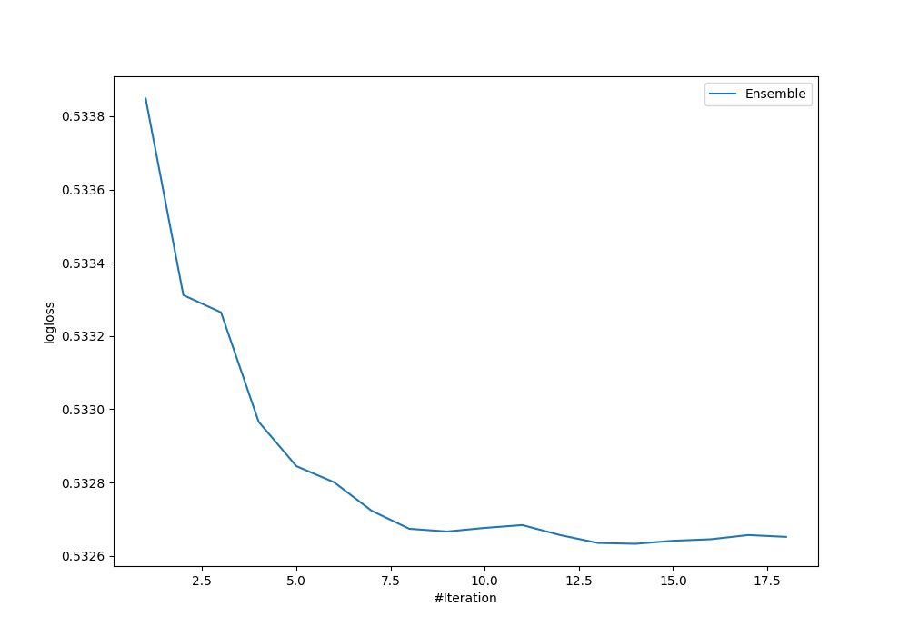

# Summary of Ensemble

[<< Go back](../README.md)

## Ensemble structure
| Model                          |   Weight |
|:-------------------------------|---------:|
| 10_Xgboost                     |        2 |
| 2_DecisionTree                 |        1 |
| 38_RandomForest_GoldenFeatures |        7 |
| 39_RandomForest                |        3 |
| 40_RandomForest_GoldenFeatures |        1 |

## Metric details
|           |    score |    threshold |
|:----------|---------:|-------------:|
| logloss   | 0.532633 | nan          |
| auc       | 0.709857 | nan          |
| f1        | 0.548944 |   0.305556   |
| accuracy  | 0.699683 |   0.433116   |
| precision | 0.504532 |   0.438553   |
| recall    | 1        |   0.00510804 |
| mcc       | 0.310036 |   0.243948   |

## Confusion matrix (at threshold=0.433116)
|                     |   Predicted as negative |   Predicted as positive |
|:--------------------|------------------------:|------------------------:|
| Labeled as negative |                    2074 |                     350 |
| Labeled as positive |                     693 |                     356 |

## Learning curves

[<< Go back](../README.md)
