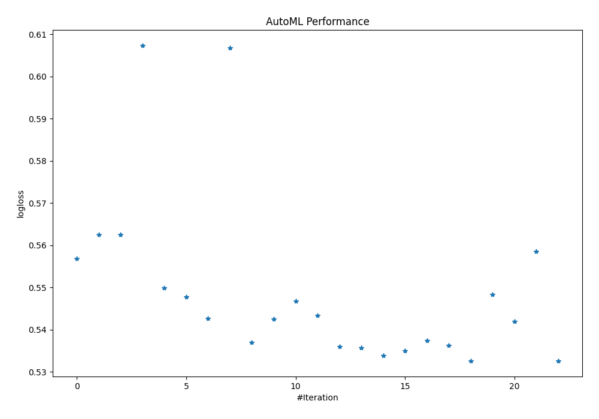

# AutoML Leaderboard

| Best model   | name                                                                                                   | model_type     | metric_type   |   metric_value |   train_time |
|:-------------|:-------------------------------------------------------------------------------------------------------|:---------------|:--------------|---------------:|-------------:|
|              | [1_DecisionTree](1_DecisionTree/README.md)                                                             | Decision Tree  | logloss       |       0.55683  |         2.3  |
|              | [2_DecisionTree](2_DecisionTree/README.md)                                                             | Decision Tree  | logloss       |       0.562527 |         1.89 |
|              | [3_DecisionTree](3_DecisionTree/README.md)                                                             | Decision Tree  | logloss       |       0.562527 |         1.91 |
|              | [4_Linear](4_Linear/README.md)                                                                         | Linear         | logloss       |       0.607262 |         4.93 |
|              | [5_Default_LightGBM](5_Default_LightGBM/README.md)                                                     | LightGBM       | logloss       |       0.549907 |         4.04 |
|              | [6_Default_Xgboost](6_Default_Xgboost/README.md)                                                       | Xgboost        | logloss       |       0.547768 |         6.65 |
|              | [7_Default_CatBoost](7_Default_CatBoost/README.md)                                                     | CatBoost       | logloss       |       0.542705 |         6.5  |
|              | [8_Default_NeuralNetwork](8_Default_NeuralNetwork/README.md)                                           | Neural Network | logloss       |       0.606686 |         4    |
|              | [9_Default_RandomForest](9_Default_RandomForest/README.md)                                             | Random Forest  | logloss       |       0.536987 |        14.63 |
|              | [19_LightGBM](19_LightGBM/README.md)                                                                   | LightGBM       | logloss       |       0.542519 |         2.55 |
|              | [10_Xgboost](10_Xgboost/README.md)                                                                     | Xgboost        | logloss       |       0.546746 |         7.46 |
|              | [28_CatBoost](28_CatBoost/README.md)                                                                   | CatBoost       | logloss       |       0.543377 |        20.8  |
|              | [37_RandomForest](37_RandomForest/README.md)                                                           | Random Forest  | logloss       |       0.536046 |        10.48 |
|              | [37_RandomForest_GoldenFeatures](37_RandomForest_GoldenFeatures/README.md)                             | Random Forest  | logloss       |       0.535696 |        20.98 |
|              | [38_RandomForest_GoldenFeatures](38_RandomForest_GoldenFeatures/README.md)                             | Random Forest  | logloss       |       0.533848 |        10.32 |
|              | [39_RandomForest](39_RandomForest/README.md)                                                           | Random Forest  | logloss       |       0.534966 |         9.25 |
|              | [40_RandomForest_GoldenFeatures](40_RandomForest_GoldenFeatures/README.md)                             | Random Forest  | logloss       |       0.537365 |         8.68 |
|              | [38_RandomForest_GoldenFeatures_BoostOnErrors](38_RandomForest_GoldenFeatures_BoostOnErrors/README.md) | Random Forest  | logloss       |       0.536326 |        10.03 |
| **the best** | [Ensemble](Ensemble/README.md)                                                                         | Ensemble       | logloss       |       0.532633 |         2.85 |
|              | [19_LightGBM_Stacked](19_LightGBM_Stacked/README.md)                                                   | LightGBM       | logloss       |       0.54838  |         2.77 |
|              | [7_Default_CatBoost_Stacked](7_Default_CatBoost_Stacked/README.md)                                     | CatBoost       | logloss       |       0.541892 |         7.27 |
|              | [5_Default_LightGBM_Stacked](5_Default_LightGBM_Stacked/README.md)                                     | LightGBM       | logloss       |       0.55848  |         5.51 |
|              | [Ensemble_Stacked](Ensemble_Stacked/README.md)                                                         | Ensemble       | logloss       |       0.532633 |         3.73 |

### AutoML Performance

### AutoML Performance Boxplot
