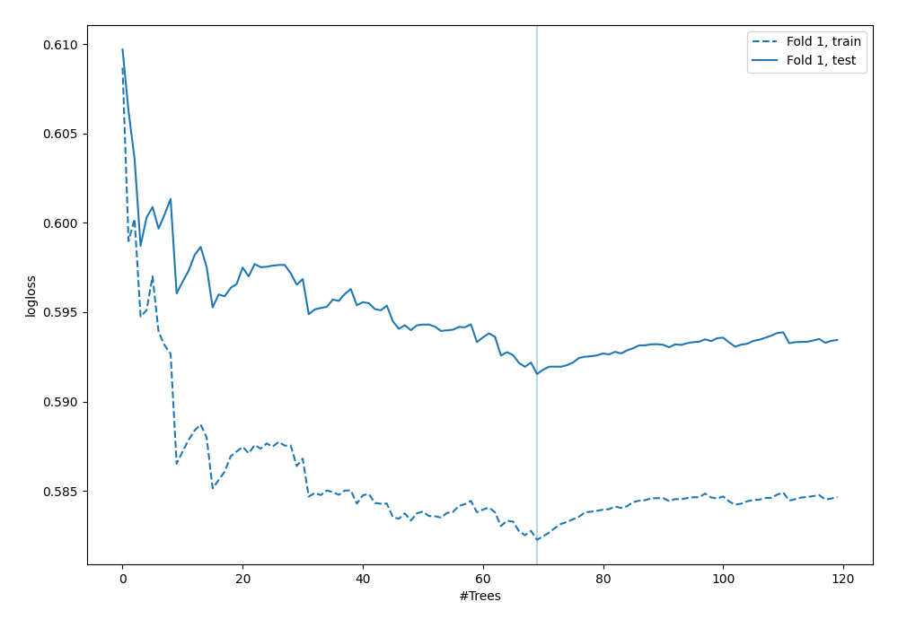

# Summary of 10_Default_ExtraTrees

[<< Go back](../README.md)

## Extra Trees Classifier (Extra Trees)
- **n_jobs**: -1
- **criterion**: gini
- **max_features**: 0.9
- **min_samples_split**: 30
- **max_depth**: 4
- **explain_level**: 0

## Validation
 - **validation_type**: split
 - **train_ratio**: 0.9
 - **shuffle**: True
 - **stratify**: True

## Optimized metric
logloss

## Training time

1.9 seconds

## Metric details
|           |    score |   threshold |
|:----------|---------:|------------:|
| logloss   | 0.591541 |  nan        |
| auc       | 0.663453 |  nan        |
| f1        | 0.54902  |    0.284045 |
| accuracy  | 0.695402 |    0.381945 |
| precision | 0.454545 |    0.381945 |
| recall    | 1        |    0.11495  |
| mcc       | 0.307671 |    0.284045 |

## Confusion matrix (at threshold=0.381945)
|                     |   Predicted as negative |   Predicted as positive |
|:--------------------|------------------------:|------------------------:|
| Labeled as negative |                     237 |                       6 |
| Labeled as positive |                     100 |                       5 |

## Learning curves

[<< Go back](../README.md)
