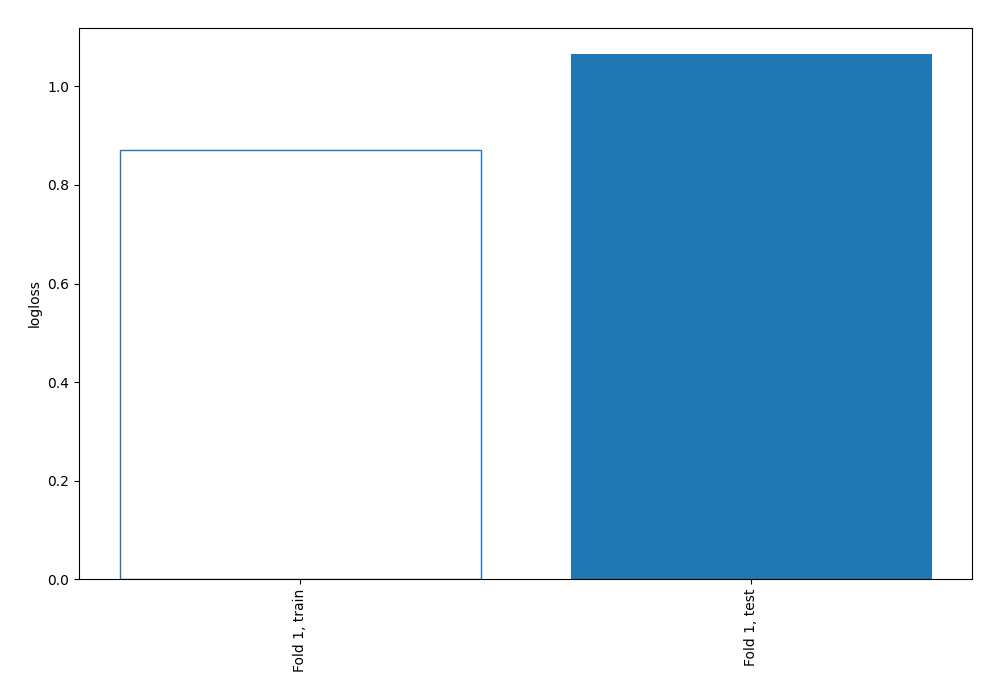

# Summary of 11_Default_NearestNeighbors

[<< Go back](../README.md)

## k-Nearest Neighbors (Nearest Neighbors)
- **n_jobs**: -1
- **n_neighbors**: 5
- **weights**: uniform
- **explain_level**: 0

## Validation
 - **validation_type**: split
 - **train_ratio**: 0.9
 - **shuffle**: True
 - **stratify**: True

## Optimized metric
logloss

## Training time

0.8 seconds

## Metric details
|           |    score |   threshold |
|:----------|---------:|------------:|
| logloss   | 1.06572  |       nan   |
| auc       | 0.578522 |       nan   |
| f1        | 0.480418 |         0   |
| accuracy  | 0.695402 |         0.6 |
| precision | 0.461538 |         0.6 |
| recall    | 0.87619  |         0   |
| mcc       | 0.126824 |         0.1 |

## Confusion matrix (at threshold=0.6)
|                     |   Predicted as negative |   Predicted as positive |
|:--------------------|------------------------:|------------------------:|
| Labeled as negative |                     236 |                       7 |
| Labeled as positive |                      99 |                       6 |

## Learning curves

[<< Go back](../README.md)
