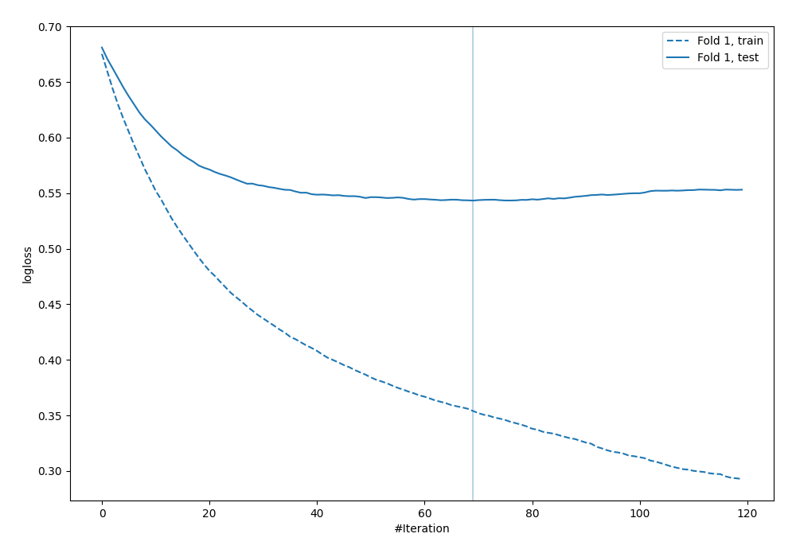

# Summary of 12_Xgboost

[<< Go back](../README.md)

## Extreme Gradient Boosting (Xgboost)
- **n_jobs**: -1
- **objective**: binary:logistic
- **eval_metric**: logloss
- **eta**: 0.05
- **max_depth**: 8
- **min_child_weight**: 5
- **subsample**: 1.0
- **colsample_bytree**: 1.0
- **explain_level**: 0

## Validation
 - **validation_type**: split
 - **train_ratio**: 0.9
 - **shuffle**: True
 - **stratify**: True

## Optimized metric
logloss

## Training time

1.8 seconds

## Metric details
|           |    score |   threshold |
|:----------|---------:|------------:|
| logloss   | 0.543357 | nan         |
| auc       | 0.699197 | nan         |
| f1        | 0.557377 |   0.184051  |
| accuracy  | 0.704023 |   0.605274  |
| precision | 0.533333 |   0.605274  |
| recall    | 1        |   0.0163493 |
| mcc       | 0.338298 |   0.163149  |

## Confusion matrix (at threshold=0.605274)
|                     |   Predicted as negative |   Predicted as positive |
|:--------------------|------------------------:|------------------------:|
| Labeled as negative |                     229 |                      14 |
| Labeled as positive |                      89 |                      16 |

## Learning curves

[<< Go back](../README.md)
