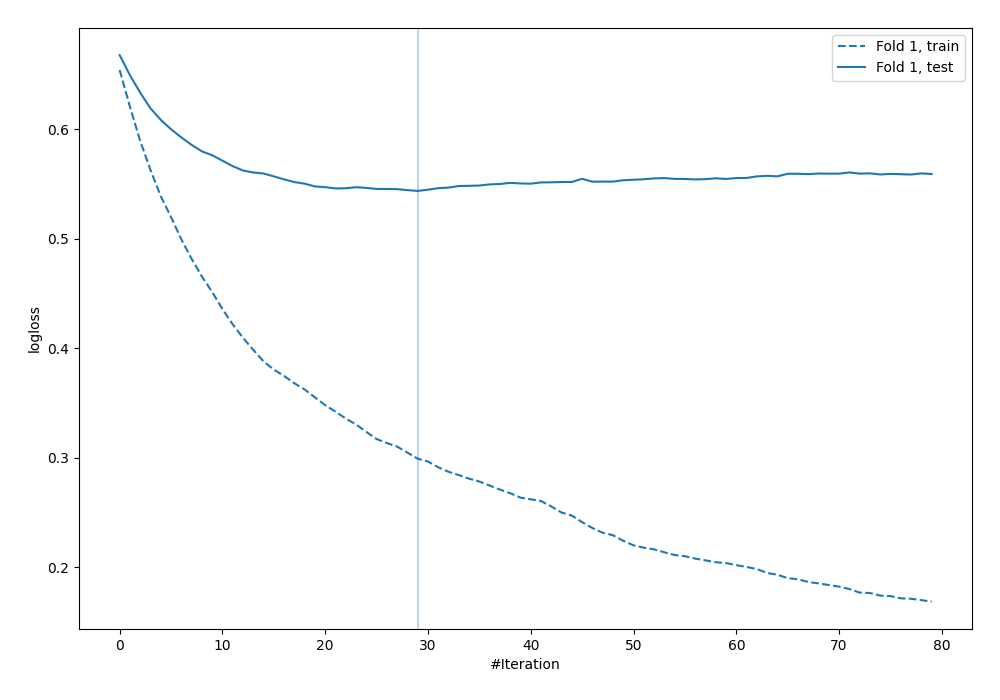

# Summary of 13_Xgboost

[<< Go back](../README.md)

## Extreme Gradient Boosting (Xgboost)
- **n_jobs**: -1
- **objective**: binary:logistic
- **eval_metric**: logloss
- **eta**: 0.1
- **max_depth**: 8
- **min_child_weight**: 1
- **subsample**: 1.0
- **colsample_bytree**: 1.0
- **explain_level**: 0

## Validation
 - **validation_type**: split
 - **train_ratio**: 0.9
 - **shuffle**: True
 - **stratify**: True

## Optimized metric
logloss

## Training time

2.0 seconds

## Metric details
|           |    score |   threshold |
|:----------|---------:|------------:|
| logloss   | 0.543732 | nan         |
| auc       | 0.714286 | nan         |
| f1        | 0.55303  |   0.343783  |
| accuracy  | 0.715517 |   0.633542  |
| precision | 0.625    |   0.633542  |
| recall    | 1        |   0.0233208 |
| mcc       | 0.314515 |   0.343783  |

## Confusion matrix (at threshold=0.633542)
|                     |   Predicted as negative |   Predicted as positive |
|:--------------------|------------------------:|------------------------:|
| Labeled as negative |                     234 |                       9 |
| Labeled as positive |                      90 |                      15 |

## Learning curves

[<< Go back](../README.md)
