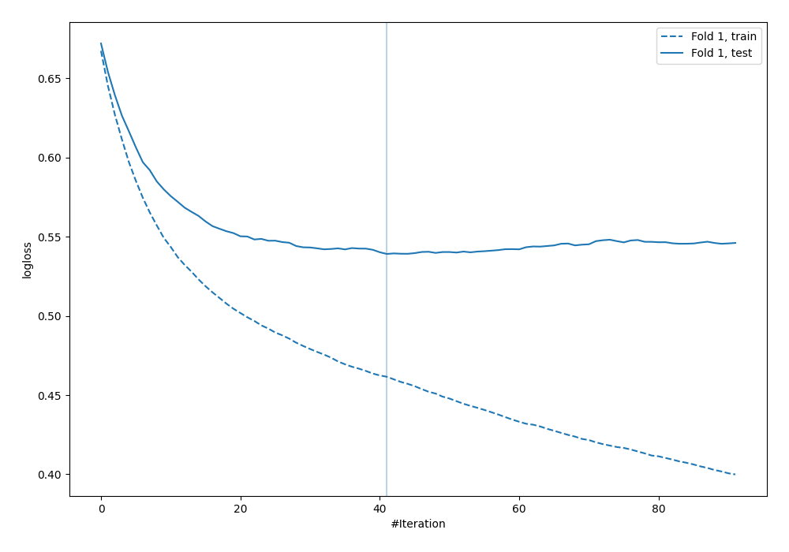

# Summary of 14_Xgboost

[<< Go back](../README.md)

## Extreme Gradient Boosting (Xgboost)
- **n_jobs**: -1
- **objective**: binary:logistic
- **eval_metric**: logloss
- **eta**: 0.1
- **max_depth**: 7
- **min_child_weight**: 25
- **subsample**: 0.9
- **colsample_bytree**: 0.6
- **explain_level**: 0

## Validation
 - **validation_type**: split
 - **train_ratio**: 0.9
 - **shuffle**: True
 - **stratify**: True

## Optimized metric
logloss

## Training time

0.9 seconds

## Metric details
|           |    score |   threshold |
|:----------|---------:|------------:|
| logloss   | 0.53917  | nan         |
| auc       | 0.70245  | nan         |
| f1        | 0.57329  |   0.285853  |
| accuracy  | 0.70977  |   0.58581   |
| precision | 0.625    |   0.58581   |
| recall    | 1        |   0.0169955 |
| mcc       | 0.343182 |   0.285853  |

## Confusion matrix (at threshold=0.58581)
|                     |   Predicted as negative |   Predicted as positive |
|:--------------------|------------------------:|------------------------:|
| Labeled as negative |                     237 |                       6 |
| Labeled as positive |                      95 |                      10 |

## Learning curves

[<< Go back](../README.md)
