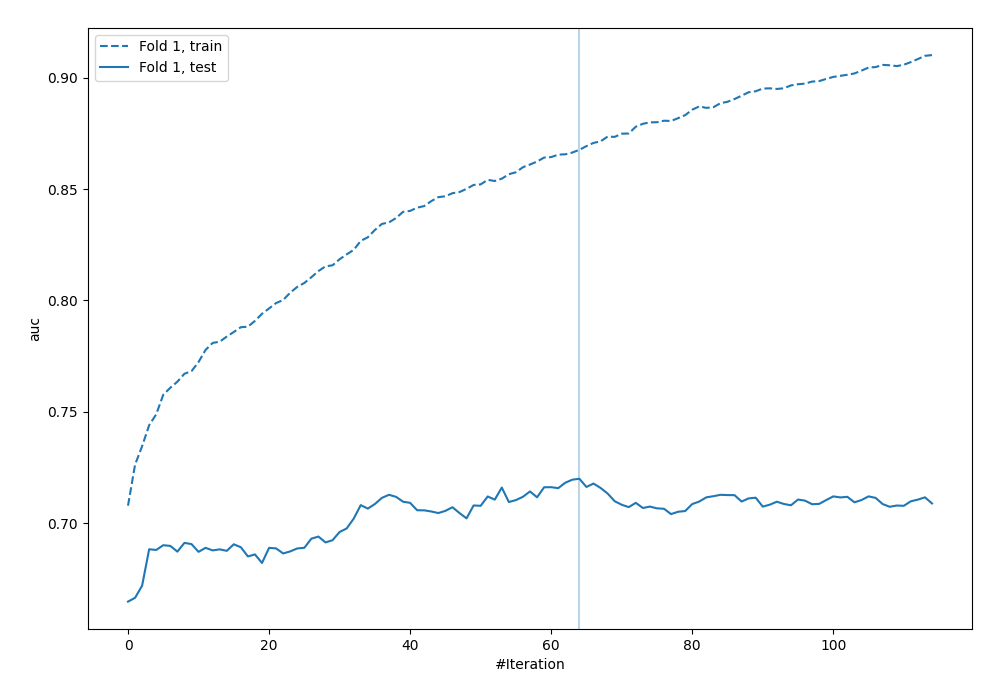

# Summary of 15_Xgboost

[<< Go back](../README.md)

## Extreme Gradient Boosting (Xgboost)
- **n_jobs**: -1
- **objective**: binary:logistic
- **eval_metric**: auc
- **eta**: 0.15
- **max_depth**: 8
- **min_child_weight**: 25
- **subsample**: 0.6
- **colsample_bytree**: 0.6
- **explain_level**: 0

## Validation
 - **validation_type**: split
 - **train_ratio**: 0.9
 - **shuffle**: True
 - **stratify**: True

## Optimized metric
logloss

## Training time

5.0 seconds

## Metric details
|           |    score |    threshold |
|:----------|---------:|-------------:|
| logloss   | 0.538541 | nan          |
| auc       | 0.71989  | nan          |
| f1        | 0.566154 |   0.242399   |
| accuracy  | 0.706897 |   0.673854   |
| precision | 0.636364 |   0.673854   |
| recall    | 1        |   0.00528398 |
| mcc       | 0.332626 |   0.242399   |

## Confusion matrix (at threshold=0.673854)
|                     |   Predicted as negative |   Predicted as positive |
|:--------------------|------------------------:|------------------------:|
| Labeled as negative |                     239 |                       4 |
| Labeled as positive |                      98 |                       7 |

## Learning curves

[<< Go back](../README.md)
