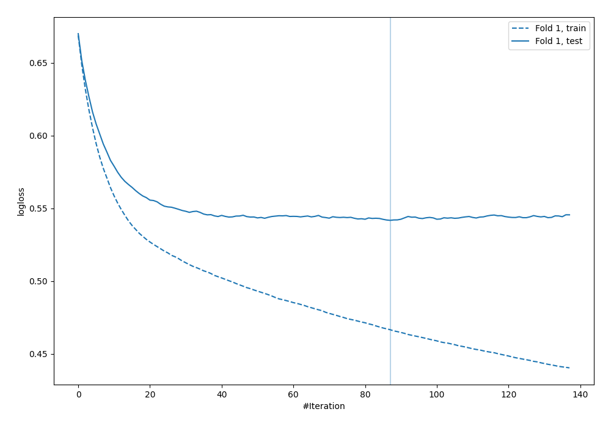

# Summary of 16_Xgboost

[<< Go back](../README.md)

## Extreme Gradient Boosting (Xgboost)
- **n_jobs**: -1
- **objective**: binary:logistic
- **eval_metric**: logloss
- **eta**: 0.1
- **max_depth**: 6
- **min_child_weight**: 50
- **subsample**: 0.9
- **colsample_bytree**: 0.7
- **explain_level**: 0

## Validation
 - **validation_type**: split
 - **train_ratio**: 0.9
 - **shuffle**: True
 - **stratify**: True

## Optimized metric
logloss

## Training time

1.1 seconds

## Metric details
|           |    score |   threshold |
|:----------|---------:|------------:|
| logloss   | 0.541818 |  nan        |
| auc       | 0.709681 |  nan        |
| f1        | 0.574924 |    0.247372 |
| accuracy  | 0.706897 |    0.496847 |
| precision | 0.538462 |    0.561327 |
| recall    | 1        |    0.012031 |
| mcc       | 0.351934 |    0.247372 |

## Confusion matrix (at threshold=0.496847)
|                     |   Predicted as negative |   Predicted as positive |
|:--------------------|------------------------:|------------------------:|
| Labeled as negative |                     220 |                      23 |
| Labeled as positive |                      79 |                      26 |

## Learning curves

[<< Go back](../README.md)
