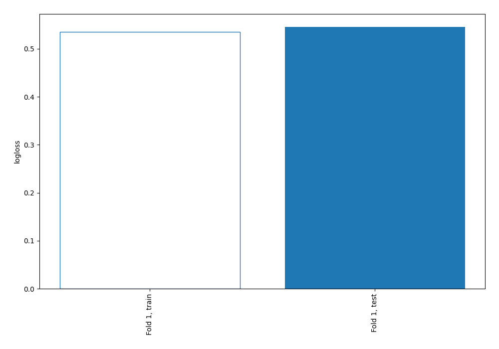

# Summary of 1_DecisionTree

[<< Go back](../README.md)

## Decision Tree
- **n_jobs**: -1
- **criterion**: gini
- **max_depth**: 3
- **explain_level**: 0

## Validation
 - **validation_type**: split
 - **train_ratio**: 0.9
 - **shuffle**: True
 - **stratify**: True

## Optimized metric
logloss

## Training time

1.0 seconds

## Metric details
|           |    score |    threshold |
|:----------|---------:|-------------:|
| logloss   | 0.545555 | nan          |
| auc       | 0.671291 | nan          |
| f1        | 0.542553 |   0.247863   |
| accuracy  | 0.701149 |   0.501754   |
| precision | 0.666667 |   0.501754   |
| recall    | 1        |   0.00972973 |
| mcc       | 0.305145 |   0.247863   |

## Confusion matrix (at threshold=0.501754)
|                     |   Predicted as negative |   Predicted as positive |
|:--------------------|------------------------:|------------------------:|
| Labeled as negative |                     242 |                       1 |
| Labeled as positive |                     103 |                       2 |

## Learning curves

[<< Go back](../README.md)
