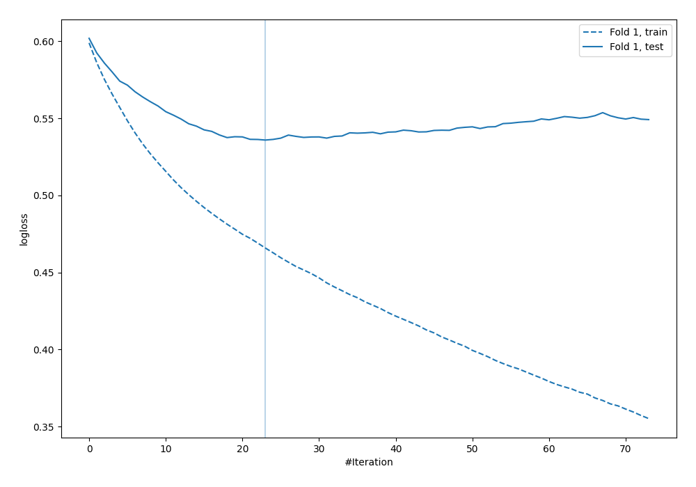
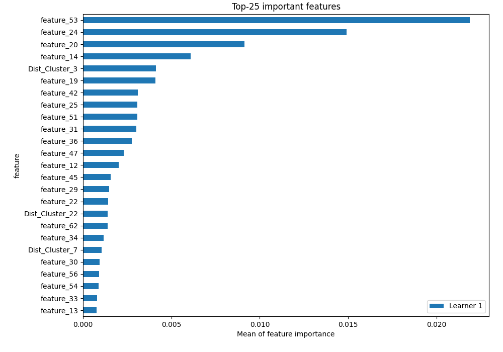

# Summary of 21_LightGBM_KMeansFeatures_RandomFeature

[<< Go back](../README.md)

## LightGBM
- **n_jobs**: -1
- **objective**: binary
- **metric**: binary_logloss
- **num_leaves**: 15
- **learning_rate**: 0.1
- **feature_fraction**: 0.8
- **bagging_fraction**: 0.8
- **min_data_in_leaf**: 10
- **explain_level**: 1

## Validation
 - **validation_type**: split
 - **train_ratio**: 0.9
 - **shuffle**: True
 - **stratify**: True

## Optimized metric
logloss

## Training time

26.9 seconds

## Metric details
|           |    score |   threshold |
|:----------|---------:|------------:|
| logloss   | 0.535879 | nan         |
| auc       | 0.705742 | nan         |
| f1        | 0.557029 |   0.208516  |
| accuracy  | 0.718391 |   0.49356   |
| precision | 0.642857 |   0.540987  |
| recall    | 1        |   0.0300161 |
| mcc       | 0.347467 |   0.208516  |

## Confusion matrix (at threshold=0.49356)
|                     |   Predicted as negative |   Predicted as positive |
|:--------------------|------------------------:|------------------------:|
| Labeled as negative |                     228 |                      15 |
| Labeled as positive |                      83 |                      22 |

## Learning curves

## Permutation-based Importance

[<< Go back](../README.md)
