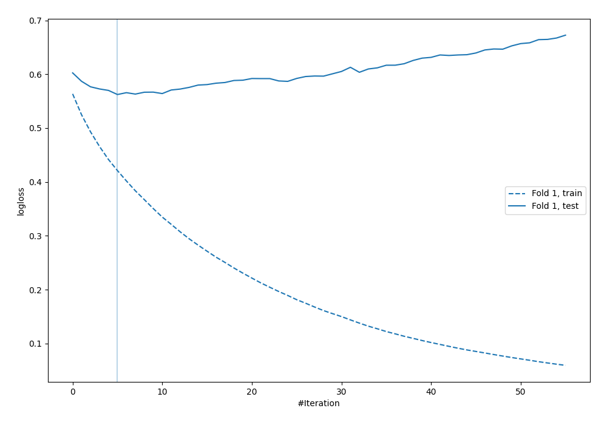

# Summary of 23_LightGBM

[<< Go back](../README.md)

## LightGBM
- **n_jobs**: -1
- **objective**: binary
- **metric**: binary_logloss
- **num_leaves**: 95
- **learning_rate**: 0.2
- **feature_fraction**: 0.9
- **bagging_fraction**: 1.0
- **min_data_in_leaf**: 30
- **explain_level**: 0

## Validation
 - **validation_type**: split
 - **train_ratio**: 0.9
 - **shuffle**: True
 - **stratify**: True

## Optimized metric
logloss

## Training time

0.9 seconds

## Metric details
|           |    score |   threshold |
|:----------|---------:|------------:|
| logloss   | 0.56234  | nan         |
| auc       | 0.685401 | nan         |
| f1        | 0.539589 |   0.224208  |
| accuracy  | 0.701149 |   0.52778   |
| precision | 0.515152 |   0.52778   |
| recall    | 1        |   0.0760427 |
| mcc       | 0.302039 |   0.150953  |

## Confusion matrix (at threshold=0.52778)
|                     |   Predicted as negative |   Predicted as positive |
|:--------------------|------------------------:|------------------------:|
| Labeled as negative |                     227 |                      16 |
| Labeled as positive |                      88 |                      17 |

## Learning curves

[<< Go back](../README.md)
