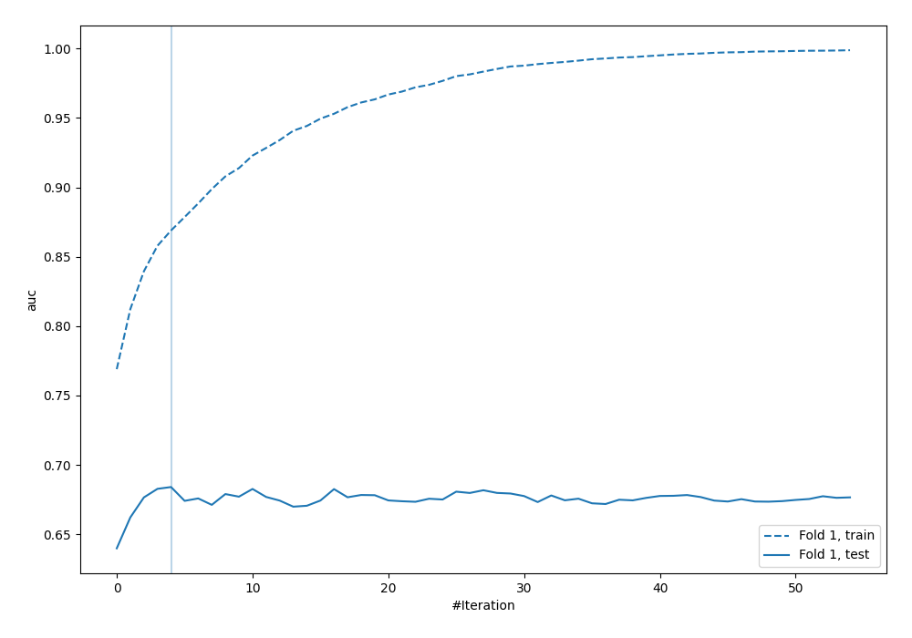

# Summary of 24_LightGBM

[<< Go back](../README.md)

## LightGBM
- **n_jobs**: -1
- **objective**: binary
- **metric**: auc
- **num_leaves**: 31
- **learning_rate**: 0.2
- **feature_fraction**: 0.5
- **bagging_fraction**: 0.8
- **min_data_in_leaf**: 10
- **explain_level**: 0

## Validation
 - **validation_type**: split
 - **train_ratio**: 0.9
 - **shuffle**: True
 - **stratify**: True

## Optimized metric
logloss

## Training time

0.7 seconds

## Metric details
|           |    score |   threshold |
|:----------|---------:|------------:|
| logloss   | 0.558356 |  nan        |
| auc       | 0.684029 |  nan        |
| f1        | 0.551282 |    0.291131 |
| accuracy  | 0.704023 |    0.469496 |
| precision | 0.533333 |    0.469496 |
| recall    | 1        |    0.101779 |
| mcc       | 0.312272 |    0.226456 |

## Confusion matrix (at threshold=0.469496)
|                     |   Predicted as negative |   Predicted as positive |
|:--------------------|------------------------:|------------------------:|
| Labeled as negative |                     229 |                      14 |
| Labeled as positive |                      89 |                      16 |

## Learning curves

[<< Go back](../README.md)
