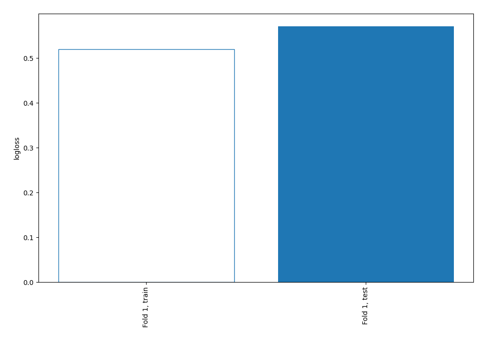

# Summary of 2_DecisionTree

[<< Go back](../README.md)

## Decision Tree
- **n_jobs**: -1
- **criterion**: gini
- **max_depth**: 4
- **explain_level**: 0

## Validation
 - **validation_type**: split
 - **train_ratio**: 0.9
 - **shuffle**: True
 - **stratify**: True

## Optimized metric
logloss

## Training time

0.6 seconds

## Metric details
|           |    score |    threshold |
|:----------|---------:|-------------:|
| logloss   | 0.570808 | nan          |
| auc       | 0.683186 | nan          |
| f1        | 0.541237 |   0.245551   |
| accuracy  | 0.706897 |   0.517431   |
| precision | 0.8      |   0.517431   |
| recall    | 1        |   0.00497238 |
| mcc       | 0.315032 |   0.245551   |

## Confusion matrix (at threshold=0.517431)
|                     |   Predicted as negative |   Predicted as positive |
|:--------------------|------------------------:|------------------------:|
| Labeled as negative |                     242 |                       1 |
| Labeled as positive |                     101 |                       4 |

## Learning curves

[<< Go back](../README.md)
